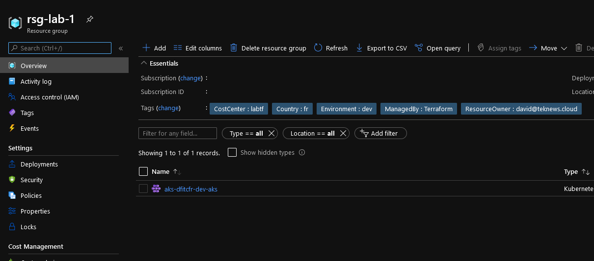
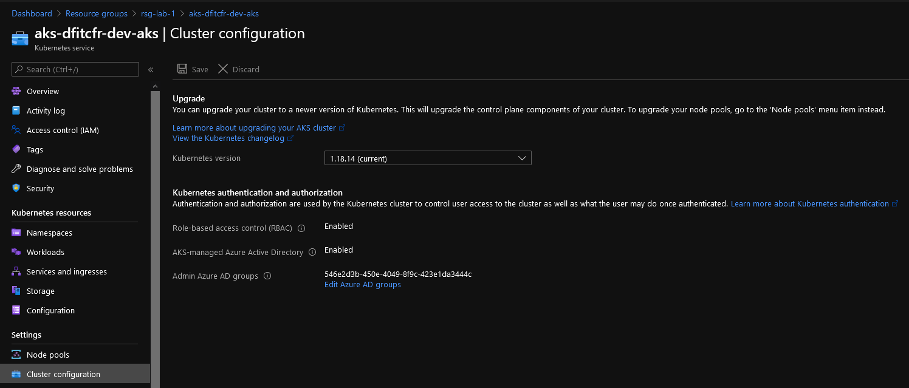
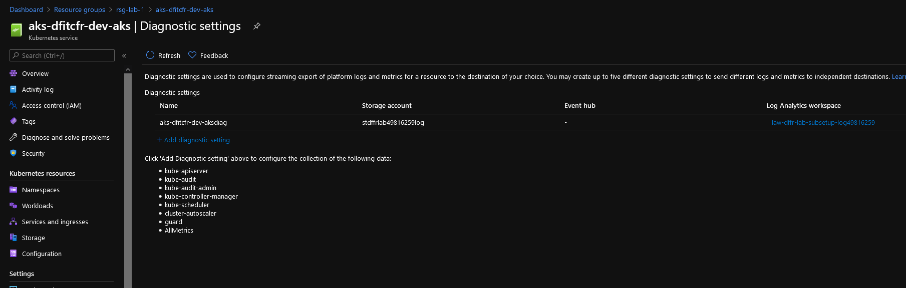

# AKS Cluster module

## Module description

This module allows the deployment of an AKS cluster with:

- RBAC Enable
- Managed Azure AD integration
- Azure CNI Networking

It includes configuration for:

- The AKS cluster resource
- The associate diagnostic settings
- Azure Monitor Alerts

Azure Monitor alerts rely on a existing Azure Action Group.
There is a delay between the cluster provisioning and the availability of the Azure monitor metric from the namespace `Insights.Container`. Thus those alert are not configured in this module.
Diagnostic settings logs are sent to a storage account and a log analytic workspace.


## Exemple configuration

Deploy the following to have a working AKS cluster:

```bash


######################################################################
# Module for RG AKS Cluster Control plane

module "ResourceGroupAKS" {

  #Module Location
  source                                = "github.com/dfrappart/Terra-AZModuletest//Modules_building_blocks//003_ResourceGroup/"
  #Module variable    
  RGSuffix                              = "aks"
  RGLocation                            = var.RGLocation
  ResourceOwnerTag                      = var.ResourceOwnerTag
  CountryTag                            = var.CountryTag
  CostCenterTag                         = var.CostCenterTag
  Company                               = var.Company
  Project                               = var.Project
  Environment                           = var.Environment


}

######################################################################
# Module for AKS

module "AKS1" {
  #Module Location
  source                                  = "github.com/dfrappart/Terra-AZModuletest//Custom_Modules//IaaS_AKS_ClusterwithRBAC_Kubenet/"

  #Module variable
  LawSubLogId                             = data.azurerm_log_analytics_workspace.LAWLogName.id
  STASubLogId                             = data.azurerm_storage_account.STALogName.id
  AKSLocation                             = module.ResourceGroupAKS.RGLocation
  AKSRGName                               = module.ResourceGroupAKS.RGName
  AKSSubnetId                             = data.azurerm_subnet.AKSSubnet.id
  APIAccessList                           = var.APIAccessList
  PublicSSHKey                            = data.azurerm_key_vault_secret.AKSPubKey.value
  AKSClusterAdminsIds                     = [var.AKSClusterAdminsIds]
  AKSNodeInstanceType                     = var.AKSNodeInstanceType
  IsAzPolicyEnabled                       = var.IsAzPolicyEnabled
  AKSNodeOSDiskSize                       = var.AKSDefaultNodePoolOSDiskSize
  ResourceOwnerTag                        = var.ResourceOwnerTag
  CountryTag                              = var.CountryTag
  CostCenterTag                           = var.CostCenterTag
  Company                                 = var.Company
  Project                                 = var.Project
  Environment                             = var.Environment

}

```

## Sample display

terraform plan should gives the following output:

```powershell

PS C:\Users\user1\Documents\IaC\Azure\Terra-AZModuletest\Tests\RG> terraform plan
module.ResourceGroup.azurerm_resource_group.TerraRG: Refreshing state... [id=/subscriptions/xxxxxxxx-xxxx-xxxx-xxxx-xxxxxxxxxxxx/resourceGroups/rsg-lab-1]

An execution plan has been generated and is shown below.  
Resource actions are indicated with the following symbols:
  + create

Terraform will perform the following actions:

  # module.AKS1.azurerm_kubernetes_cluster.TerraAKSwithRBAC will be created
  + resource "azurerm_kubernetes_cluster" "TerraAKSwithRBAC" {
      + dns_prefix              = "aksaksdev"
      + fqdn                    = (known after apply)
      + id                      = (known after apply)
      + kube_admin_config       = (known after apply)
      + kube_admin_config_raw   = (sensitive value)  
      + kube_config             = (known after apply)
      + kube_config_raw         = (sensitive value)  
      + kubelet_identity        = (known after apply)
      + kubernetes_version      = (known after apply)
      + location                = "westeurope"
      + name                    = "aks-dfitcfr-dev-aks"
      + node_resource_group     = "rsg-dfitcfr-dev-aks-aksobjects"
      + private_cluster_enabled = (known after apply)
      + private_fqdn            = (known after apply)
      + private_link_enabled    = (known after apply)
      + resource_group_name     = "rsg-lab-1"        
      + sku_tier                = "Free"
      + tags                    = {
          + "CostCenter"      = "labtf"
          + "Country"         = "fr"    
          + "Environment"     = "dev"
          + "ManagedBy"       = "Terraform"
          + "ResourceOwner"   = "david@teknews.cloud"
        }

      + addon_profile {

          + azure_policy {
              + enabled = false
            }

          + http_application_routing {
              + enabled                            = false
              + http_application_routing_zone_name = (known after apply)
            }

          + kube_dashboard {
              + enabled = true
            }

          + oms_agent {
              + enabled                    = true
              + log_analytics_workspace_id = "/subscriptions/xxxxxxxx-xxxx-xxxx-xxxx-xxxxxxxxxxxx/resourceGroups/rsg-dffr-lab-subsetup-log/providers/Microsoft.OperationalInsights/workspaces/law-dffr-lab-subsetup-log49816259"
              + oms_agent_identity         = (known after apply)
            }
        }

      + auto_scaler_profile {
          + balance_similar_node_groups      = false
          + max_graceful_termination_sec     = (known after apply)
          + new_pod_scale_up_delay           = (known after apply)
          + scale_down_delay_after_add       = (known after apply)
          + scale_down_delay_after_delete    = (known after apply)
          + scale_down_delay_after_failure   = (known after apply)
          + scale_down_unneeded              = (known after apply)
          + scale_down_unready               = (known after apply)
          + scale_down_utilization_threshold = (known after apply)
          + scan_interval                    = (known after apply)
        }

      + default_node_pool {
          + availability_zones   = [
              + "1",
              + "2",
              + "3",
            ]
          + enable_auto_scaling  = true
          + max_count            = 10
          + max_pods             = 100
          + min_count            = 2
          + name                 = "aksnp0devaks"
          + node_count           = 3
          + orchestrator_version = (known after apply)
          + os_disk_size_gb      = 127
          + os_disk_type         = "Managed"
          + tags                 = {
              + "AKSNodePool"     = "aksnp0devaks"
              + "CostCenter"      = "labtf"
              + "Country"         = "fr"
              + "Environment"     = "dev"
              + "ManagedBy"       = "Terraform"
              + "ResourceOwner"   = "david@teknews.cloud"
            }
          + type                 = "VirtualMachineScaleSets"
          + vm_size              = "Standard_DS2_v2"
          + vnet_subnet_id       = "/subscriptions/xxxxxxxx-xxxx-xxxx-xxxx-xxxxxxxxxxxx/resourceGroups/rsg-vnet/providers/Microsoft.Network/virtualNetworks/vnet-aks/subnets/aks-subnet"
        }

      + identity {
          + principal_id = (known after apply)
          + tenant_id    = (known after apply)
          + type         = "SystemAssigned"
        }

      + linux_profile {
          + admin_username = "AKSAdmin"

          + ssh_key {
              + key_data = "ssh-rsa AAAAB..."
            }
        }

      + network_profile {
          + dns_service_ip     = (known after apply)
          + docker_bridge_cidr = (known after apply)
          + load_balancer_sku  = "standard"
          + network_mode       = (known after apply)
          + network_plugin     = "kubenet"
          + network_policy     = "calico"
          + outbound_type      = "loadBalancer"
          + pod_cidr           = (known after apply)
          + service_cidr       = (known after apply)

          + load_balancer_profile {
              + effective_outbound_ips    = (known after apply)
              + idle_timeout_in_minutes   = (known after apply)
              + managed_outbound_ip_count = (known after apply)
              + outbound_ip_address_ids   = (known after apply)
              + outbound_ip_prefix_ids    = (known after apply)
              + outbound_ports_allocated  = (known after apply)
            }
        }

      + role_based_access_control {
          + enabled = true

          + azure_active_directory {
              + admin_group_object_ids = [
                  + "xxxxxxxx-xxxx-xxxx-xxxx-xxxxxxxxxxxxc",
                ]
              + managed                = true
              + tenant_id              = (known after apply)
            }
        }

      + windows_profile {
          + admin_password = (sensitive value)
          + admin_username = (known after apply)
        }
    }

  # module.AKS1.azurerm_monitor_diagnostic_setting.AKSDiag will be created
  + resource "azurerm_monitor_diagnostic_setting" "AKSDiag" {
      + id                         = (known after apply)
      + log_analytics_workspace_id = "/subscriptions/xxxxxxxx-xxxx-xxxx-xxxx-xxxxxxxxxxxx/resourceGroups/rsg-dffr-lab-subsetup-log/providers/Microsoft.OperationalInsights/workspaces/law-dffr-lab-subsetup-log49816259"
      + name                       = "aks-dfitcfr-dev-aksdiag"
      + storage_account_id         = "/subscriptions/xxxxxxxx-xxxx-xxxx-xxxx-xxxxxxxxxxxx/resourceGroups/rsg-dffr-lab-subsetup-log/providers/Microsoft.Storage/storageAccounts/stdffrlab49816259log"
      + target_resource_id         = (known after apply)

      + log {
          + category = "cluster-autoscaler"
          + enabled  = true

          + retention_policy {
              + days    = 365
              + enabled = true
            }
        }
      + log {
          + category = "guard"
          + enabled  = true

          + retention_policy {
              + days    = 365
              + enabled = true
            }
        }
      + log {
          + category = "kube-apiserver"
          + enabled  = true

          + retention_policy {
              + days    = 365
              + enabled = true
            }
        }
      + log {
          + category = "kube-audit"
          + enabled  = true

          + retention_policy {
              + days    = 365
              + enabled = true
            }
        }
      + log {
          + category = "kube-audit-admin"
          + enabled  = true

          + retention_policy {
              + days    = 365
              + enabled = true
            }
        }
      + log {
          + category = "kube-controller-manager"
          + enabled  = true

          + retention_policy {
              + days    = 365
              + enabled = true
            }
        }
      + log {
          + category = "kube-scheduler"
          + enabled  = true

          + retention_policy {
              + days    = 365
              + enabled = true
            }
        }

      + metric {
          + category = "AllMetrics"
          + enabled  = true

          + retention_policy {
              + days    = 365
              + enabled = true
            }
        }
    }

Plan: 2 to add, 0 to change, 0 to destroy.

------------------------------------------------------------------------

Note: You didn't specify an "-out" parameter to save this plan, so Terraform
can't guarantee that exactly these actions will be performed if
"terraform apply" is subsequently run.

```

Output should be simmilar to this:

```powershell

Apply complete! Resources: 2 added, 0 changed, 0 destroyed.

Outputs:

KubeAdminCFG = <sensitive>
KubeAdminCFGRaw = <sensitive>
KubeAdminCFG_ClientCertificate = <sensitive>
KubeAdminCFG_ClientKey = <sensitive>
KubeAdminCFG_ClusCACert = <sensitive>
KubeAdminCFG_HostName = <sensitive>
KubeAdminCFG_Password = <sensitive>
KubeAdminCFG_UserName = <sensitive>
KubeControlPlane_SAI = <sensitive>
KubeControlPlane_SAI_PrincipalId = <sensitive>
KubeControlPlane_SAI_TenantId = <sensitive>
KubeFQDN = "aksaksdev-6f33411e.hcp.westeurope.azmk8s.io"
KubeId = <sensitive>
KubeKubelet_UAI = <sensitive>
KubeKubelet_UAI_ClientId = <sensitive>
KubeKubelet_UAI_Id = <sensitive>
KubeKubelet_UAI_ObjectId = <sensitive>
KubeLocation = "westeurope"
KubeName = "aks-dfitcfr-dev-aks"
KubeRG = "rsg-lab-1"
KubeVersion = "1.18.14"
RGId = <sensitive>
RGLocation = "westeurope"
RGName = "rsg-lab-1"

```

## Sample deployment

After deployment, something simlilar is visible in the portal:









