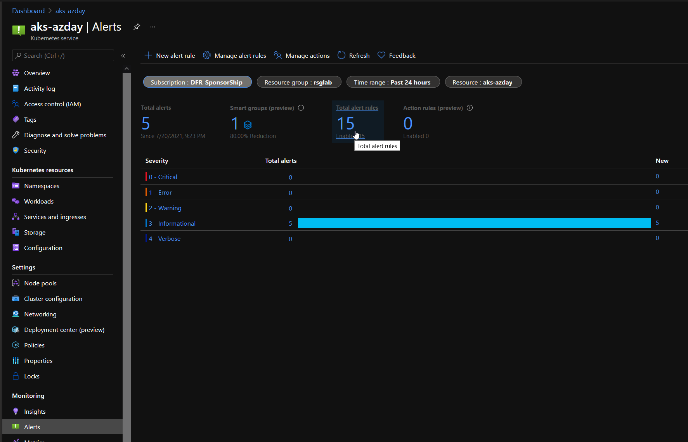
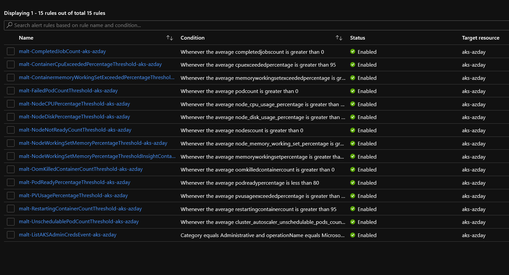

# AKS Cluster Recommanded alerting module

## Module description

- This module allows the deployment of Azure monitor alert for AKS based on the Insight/Container extension.
- It requires that the Identity associated to the cluster is allowed to publish metrics in Azure monitor through a specific role assignment

### Module inputs

| Variable name | Variable type | Default value | Description |
|:--------------|:--------------|:--------------|:------------|


### Module outputs

N/A

## Exemple configuration

Deploy the following to have a working AKS cluster:

```bash


```

## Sample display

terraform plan should gives the following output:

```powershell


```

Output should be simmilar to this:

```powershell


```

## Sample deployment

After deployment, something simlilar is visible in the portal:






