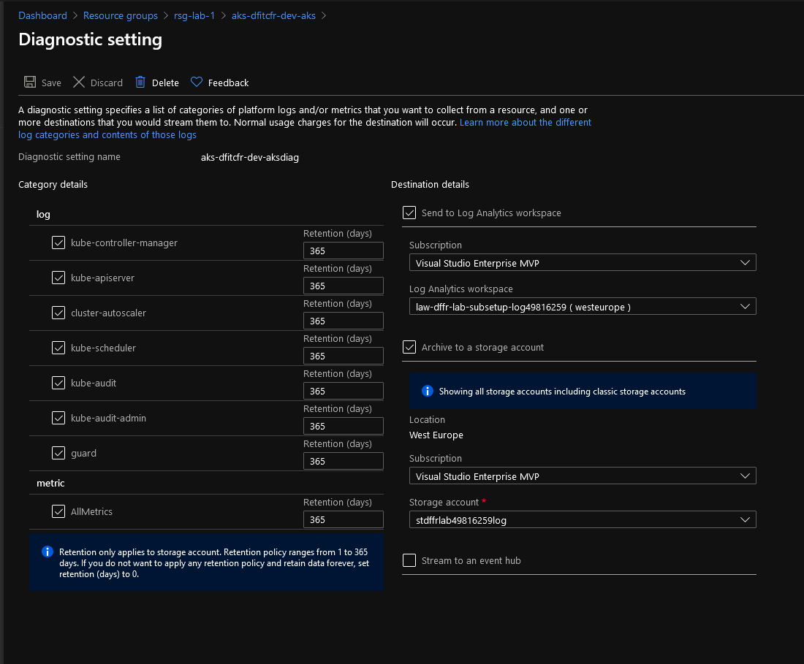
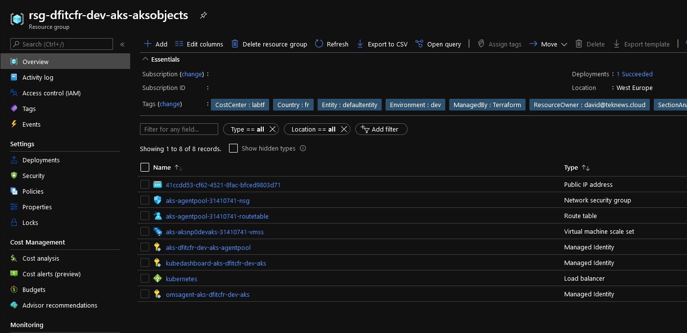

# AKS Cluster Kubenet module

## Module description

This module allows the deployment of an AKS cluster with:
- RBAC Enable
- Managed Azure AD integration
- Kubenet Networking

It includes configuration for:

- The AKS cluster resource
- The associate diagnostic settings

Future versions will include:

- Azure Monitor Alerts

Azure Monitor alerts rely on a existing Azure Action Group.

Diagnostic settings logs are sent to a storage account and a log analytic workspace.

### Module inputs

| Variable name | Variable type | Default value | Description |
|:--------------|:--------------|:--------------|:------------|
| RGLogName | string | N/A | Name of the RG containing the logs collector objects (sta and log analytics) |
| LawSubLogName | string | N/A | Name of the log analytics workspace containing the logs |
| STASubLogName | string | N/A | Name of the storage account containing the logs |
| AKSLocation | string | westeurope | The region for AKS |
| AKSRGName | string | N/A | The RG for for AKS |
| AKSNodeInstanceType | string | "Standard_DS2_v2" | The type of Azure instance for the pool |
| AKSAZ | list | ["1","2","3"] | The list of AZ to use |
| EnableAKSAutoScale | string | true | Is autoscaling enabled for this node pool |
| EnableNodePublicIP | string | null | Define if Nodes get Public IP. Default API value is false |
| AKSMaxPods | string | 100 | Define the max pod number per nodes, Change force new resoure to be created |
| AKSNodeLabels | map | hqazureinitiative | Tag describing the owner |
| AKSNodeTaints | string | fr | Tag describing the Rexel Country |
| AKSNodeOSDiskSize | string | 30 | The size of the OS Disk which should be used for each agent in the Node Pool. Changing this forces a new resource to be created. |
| AKSSubnetId | string | N/A | The ID of a Subnet where the Kubernetes Node Pool should exist. Changing this forces a new resource to be created. |
| MaxAutoScaleCount | string | 10 | The maximum number of nodes which should exist in this Node Pool. If specified this must be between 1 and 100 |
| MinAutoScaleCount | string | 2 | The minimum number of nodes which should exist in this Node Pool. If specified this must be between 1 and 100 |
| AKSNodeCount | string | 3 | The number of nodes which should exist in this Node Pool. If specified this must be between 1 and 100. |
| KubeVersion | string | null | The version of Kube, used for Node pool version but also for Control plane version |
| APIAccessList | list(string) | null | The IP ranges to whitelist for incoming traffic to the masters. |
| AutoScaleProfilBalanceSimilarNdGP | string | null | Detect similar node groups and balance the number of nodes between them. Defaults to false. |
| AutoScaleProfilMaxGracefullTerm | string | null | Maximum number of seconds the cluster autoscaler waits for pod termination when trying to scale down a node. Defaults to 600. |
| AutoScaleProfilScaleDownAfterAdd | string | null | How long after the scale up of AKS nodes the scale down evaluation resumes. Defaults to 10m. |
| AutoScaleProfilScaleDownAfterDelete | string | null | How long after node deletion that scale down evaluation resumes. Defaults to the value used for scan_interval. |
| AutoScaleProfilScaleDownAfterFail | string | null | How long after scale down failure that scale down evaluation resumes. Defaults to 3m. |
| AutoScaleProfilScanInterval | string | null | How often the AKS Cluster should be re-evaluated for scale up/down. Defaults to 10s. |
| AutoScaleProfilScaleDownUnneeded | string | null | How long a node should be unneeded before it is eligible for scale down. Defaults to 10m. |
| AutoScaleProfilScaleDownUnready | string | null | How long an unready node should be unneeded before it is eligible for scale down. Defaults to 20m. |
| AutoScaleProfilScaleDownUtilThreshold | string | null | Node utilization level, defined as sum of requested resources divided by capacity, below which a node can be considered for scale down. Defaults to 0.5. |
| AKSDiskEncryptionId | string | null | the encryption id to encrypted nodes disk. Default to null to use Azure managed encryption. |
| AKSAdminName | string | "AKSAdmin" | The Admin Username for the Cluster. Changing this forces a new resource to be created. |
| PublicSSHKey | string | N/A | An ssh_key block. Only one is currently allowed. Changing this forces a new resource to be created. |
| AKSNetworkDNS | string | null | IP address within the Kubernetes service address range that will be used by cluster service discovery (kube-dns). Changing this forces a new resource to be created. |
| AKSDockerBridgeCIDR | string | null | IP address (in CIDR notation) used as the Docker bridge IP address on nodes. Changing this forces a new resource to be created. |
| AKSOutboundType | string | null | The outbound (egress) routing method which should be used for this Kubernetes Cluster. Possible values are loadBalancer and userDefinedRouting. Defaults to loadBalancer. |
| AKSPodCIDR | string | null | The CIDR to use for pod IP addresses. This field can only be set when network_plugin is set to kubenet. Changing this forces a new resource to be created. |
| AKSSVCCIDR | string | null | The Network Range used by the Kubernetes service. Changing this forces a new resource to be created. |
| AKSLBSku | string | null | Specifies the SKU of the Load Balancer used for this Kubernetes Cluster. Possible values are Basic and Standard. Defaults to Standard. |
| AKSNodesRG | string | null | The name of the Resource Group where the Kubernetes Nodes should exist. Changing this forces a new resource to be created.|
| IsAKSPrivate | string | null | Should this Kubernetes Cluster have it's API server only exposed on internal IP addresses? This provides a Private IP Address for the Kubernetes API on the Virtual Network where the Kubernetes Cluster is located. Defaults to false. Changing this forces a new resource to be created.|
| AKSClusterAdminsIds | list | null | A list of Object IDs of Azure Active Directory Groups which should have Admin Role on the Cluster.|
| IsAzPolicyEnabled | string | false | Is the Azure Policy for Kubernetes Add On enabled? |
| IshttproutingEnabled | string | false | Is HTTP Application Routing Enabled? Changing this forces a new resource to be created. |
| IsKubeDashboardEnabled | string | true | Is the Kubernetes Dashboard enabled? |
| IsOMSAgentEnabled | string | true | Is the OMS Agent enabled? || ResourceOwnerTag | string | hqazureinitiative | Tag describing the owner |
| CountryTag | string | fr | Tag describing the Country |
| CostCenterTag | string | lab | Tag describing the Cost Center |
| Company | string | dfitc | The Company owner of the resource |
| Project | string | tfmodule | The name of the project |
| Environment | string | dev | The environment, dev, prod... |


### Module outputs

| Output name | Value | Description |
|:------------|:------------|:------|
| FullAKS | `azurerm_kubernetes_cluster.TerraAKSwithRBAC` | Send all the resource infromation available in the output. In future version, this may be the only output and detailed informtion will probably be queried specifically from the root module | 
| KubeName | `azurerm_kubernetes_cluster.TerraAKSwithRBAC.name` | The name of the resource | 
| KubeLocation | `azurerm_kubernetes_cluster.TerraAKSwithRBAC.location` |The location of the AKS Cluster | 
| KubeRG | `azurerm_kubernetes_cluster.TerraAKSwithRBAC.resource_group_name` | The resource group for AKS | 
| KubeVersion | `azurerm_kubernetes_cluster.TerraAKSwithRBAC.kubernetes_version` |The version of AKS | 
| KubeId | `azurerm_kubernetes_cluster.TerraAKSwithRBAC.id` |The AKS resource ID | 
| KubeFQDN | `azurerm_kubernetes_cluster.TerraAKSwithRBAC.fqdn` |AKS public fqdn | 
| KubeAdminCFGRaw | `azurerm_kubernetes_cluster.TerraAKSwithRBAC.kube_admin_config_raw` | Kubernetes raw information - Sensitive information | 
| KubeAdminCFG | `azurerm_kubernetes_cluster.TerraAKSwithRBAC.kube_admin_config` | kubernetes admin config - sensitive information | 
| KubeAdminCFG_UserName | `azurerm_kubernetes_cluster.TerraAKSwithRBAC.kube_admin_config.0.username` |AKS admin name | 
| KubeAdminCFG_HostName | `azurerm_kubernetes_cluster.TerraAKSwithRBAC.kube_admin_config.0.host` | AKS hostname | 
| KubeAdminCFG_Password |  `azurerm_kubernetes_cluster.TerraAKSwithRBAC.kube_admin_config.0.password` |AKS Admin Password - Sensitive information |
| KubeAdminCFG_ClientKey | `azurerm_kubernetes_cluster.TerraAKSwithRBAC.kube_admin_config.0.client_key` |AKS Admin Key - Sensitive information | 
| KubeAdminCFG_ClientCertificate | `azurerm_kubernetes_cluster.TerraAKSwithRBAC.kube_admin_config.0.client_certificate` |AKS Admin Certificate - Sensitive information | 
| KubeAdminCFG_ClusCACert | `azurerm_kubernetes_cluster.TerraAKSwithRBAC.kube_admin_config.0.cluster_ca_certificate` | AKS Cluster CA Certificate - Sensitive information |  
| KubeControlPlane_SAI | `azurerm_kubernetes_cluster.TerraAKSwithRBAC.identity` | AKS Control plane Managed Identity block| 
| KubeControlPlane_SAI_PrincipalId | `azurerm_kubernetes_cluster.TerraAKSwithRBAC.identity[0].principal_id` |AKS Control plane Managed Identity principal Id | 
| KubeControlPlane_SAI_PrincipalId | `azurerm_kubernetes_cluster.TerraAKSwithRBAC.identity[0].tenant_id` | AKS Control plane Managed Identity Tenant Id | 
| KubeKubelet_UAI | `azurerm_kubernetes_cluster.TerraAKSwithRBAC.kubelet_identity` | User Assigned Identity block for the Kubelet | 
| KubeKubelet_UAI_ClientId | `azurerm_kubernetes_cluster.TerraAKSwithRBAC.kubelet_identity[0].client_id` |User Assigned Identity for kubelet principal Id |  
| KubeKubelet_UAI_ObjectId |  `azurerm_kubernetes_cluster.TerraAKSwithRBAC.kubelet_identity[0].object_id` | User Assigned Identity for kubelet object Id |
| KubeKubelet_UAI_Id | `azurerm_kubernetes_cluster.TerraAKSwithRBAC.kubelet_identity[0].user_assigned_identity_id` | User Assigned Identity for kubelet resource Id | 
| NodeRG | `azurerm_kubernetes_cluster.TerraAKSwithRBAC.node_resource_group` | The name of the resource group containing the nodes and other related AKS resources such as UAI and LB... | 

## Exemple configuration

Deploy the following to have a working AKS cluster:

```bash


######################################################################
# Module for RG AKS Cluster Control plane

module "ResourceGroupAKS" {

  #Module Location
  source                                = "github.com/dfrappart/Terra-AZModuletest//Modules_building_blocks//003_ResourceGroup/"
  #Module variable    
  RGSuffix                              = "aks"
  RGLocation                            = var.RGLocation
  ResourceOwnerTag                      = var.ResourceOwnerTag
  CountryTag                            = var.CountryTag
  CostCenterTag                         = var.CostCenterTag
  Company                               = var.Company
  Project                               = var.Project
  Environment                           = var.Environment


}

######################################################################
# Module for AKS

module "AKS1" {
  #Module Location
  source                                  = "github.com/dfrappart/Terra-AZModuletest//Custom_Modules//IaaS_AKS_ClusterwithRBAC_Kubenet/"

  #Module variable
  RGLogName                               = data.azurerm_resource_group.RGLog.name
  LawSubLogName                           = data.azurerm_log_analytics_workspace.LAWLogName.name
  STASubLogName                           = data.azurerm_storage_account.STALogName.name
  AKSLocation                             = module.ResourceGroupAKS.RGLocation
  AKSRGName                               = module.ResourceGroupAKS.RGName
  AKSSubnetId                             = data.azurerm_subnet.AKSSubnet.id
  APIAccessList                           = var.APIAccessList
  PublicSSHKey                            = data.azurerm_key_vault_secret.AKSPubKey.value
  AKSClusterAdminsIds                     = [var.AKSClusterAdminsIds]
  AKSNodeInstanceType                     = var.AKSNodeInstanceType
  IsAzPolicyEnabled                       = var.IsAzPolicyEnabled
  AKSNodeOSDiskSize                       = var.AKSDefaultNodePoolOSDiskSize
  ResourceOwnerTag                        = var.ResourceOwnerTag
  CountryTag                              = var.CountryTag
  CostCenterTag                           = var.CostCenterTag
  Company                                 = var.Company
  Project                                 = var.Project
  Environment                             = var.Environment

}

```

## Sample display

terraform plan should gives the following output:

```powershell

PS C:\Users\user1\Documents\IaC\Azure\Terra-AZModuletest\Tests\RG> terraform plan
module.ResourceGroup.azurerm_resource_group.TerraRG: Refreshing state... [id=/subscriptions/xxxxxxxx-xxxx-xxxx-xxxx-xxxxxxxxxxxx/resourceGroups/rsg-lab-1]

An execution plan has been generated and is shown below.  
Resource actions are indicated with the following symbols:
  + create

Terraform will perform the following actions:

  # module.AKS1.azurerm_kubernetes_cluster.TerraAKSwithRBAC will be created
  + resource "azurerm_kubernetes_cluster" "TerraAKSwithRBAC" {
      + dns_prefix              = "aksaksdev"
      + fqdn                    = (known after apply)
      + id                      = (known after apply)
      + kube_admin_config       = (known after apply)
      + kube_admin_config_raw   = (sensitive value)  
      + kube_config             = (known after apply)
      + kube_config_raw         = (sensitive value)  
      + kubelet_identity        = (known after apply)
      + kubernetes_version      = (known after apply)
      + location                = "westeurope"
      + name                    = "aks-dfitcfr-dev-aks"
      + node_resource_group     = "rsg-dfitcfr-dev-aks-aksobjects"
      + private_cluster_enabled = (known after apply)
      + private_fqdn            = (known after apply)
      + private_link_enabled    = (known after apply)
      + resource_group_name     = "rsg-lab-1"        
      + sku_tier                = "Free"
      + tags                    = {
          + "CostCenter"      = "labtf"
          + "Country"         = "fr"    
          + "Environment"     = "dev"
          + "ManagedBy"       = "Terraform"
          + "ResourceOwner"   = "david@teknews.cloud"
        }

      + addon_profile {

          + azure_policy {
              + enabled = false
            }

          + http_application_routing {
              + enabled                            = false
              + http_application_routing_zone_name = (known after apply)
            }

          + kube_dashboard {
              + enabled = true
            }

          + oms_agent {
              + enabled                    = true
              + log_analytics_workspace_id = "/subscriptions/xxxxxxxx-xxxx-xxxx-xxxx-xxxxxxxxxxxx/resourceGroups/rsg-dffr-lab-subsetup-log/providers/Microsoft.OperationalInsights/workspaces/law-dffr-lab-subsetup-log49816259"
              + oms_agent_identity         = (known after apply)
            }
        }

      + auto_scaler_profile {
          + balance_similar_node_groups      = false
          + max_graceful_termination_sec     = (known after apply)
          + new_pod_scale_up_delay           = (known after apply)
          + scale_down_delay_after_add       = (known after apply)
          + scale_down_delay_after_delete    = (known after apply)
          + scale_down_delay_after_failure   = (known after apply)
          + scale_down_unneeded              = (known after apply)
          + scale_down_unready               = (known after apply)
          + scale_down_utilization_threshold = (known after apply)
          + scan_interval                    = (known after apply)
        }

      + default_node_pool {
          + availability_zones   = [
              + "1",
              + "2",
              + "3",
            ]
          + enable_auto_scaling  = true
          + max_count            = 10
          + max_pods             = 100
          + min_count            = 2
          + name                 = "aksnp0devaks"
          + node_count           = 3
          + orchestrator_version = (known after apply)
          + os_disk_size_gb      = 127
          + os_disk_type         = "Managed"
          + tags                 = {
              + "AKSNodePool"     = "aksnp0devaks"
              + "CostCenter"      = "labtf"
              + "Country"         = "fr"
              + "Environment"     = "dev"
              + "ManagedBy"       = "Terraform"
              + "ResourceOwner"   = "david@teknews.cloud"
            }
          + type                 = "VirtualMachineScaleSets"
          + vm_size              = "Standard_DS2_v2"
          + vnet_subnet_id       = "/subscriptions/xxxxxxxx-xxxx-xxxx-xxxx-xxxxxxxxxxxx/resourceGroups/rsg-vnet/providers/Microsoft.Network/virtualNetworks/vnet-aks/subnets/aks-subnet"
        }

      + identity {
          + principal_id = (known after apply)
          + tenant_id    = (known after apply)
          + type         = "SystemAssigned"
        }

      + linux_profile {
          + admin_username = "AKSAdmin"

          + ssh_key {
              + key_data = "ssh-rsa AAAAB..."
            }
        }

      + network_profile {
          + dns_service_ip     = (known after apply)
          + docker_bridge_cidr = (known after apply)
          + load_balancer_sku  = "standard"
          + network_mode       = (known after apply)
          + network_plugin     = "kubenet"
          + network_policy     = "calico"
          + outbound_type      = "loadBalancer"
          + pod_cidr           = (known after apply)
          + service_cidr       = (known after apply)

          + load_balancer_profile {
              + effective_outbound_ips    = (known after apply)
              + idle_timeout_in_minutes   = (known after apply)
              + managed_outbound_ip_count = (known after apply)
              + outbound_ip_address_ids   = (known after apply)
              + outbound_ip_prefix_ids    = (known after apply)
              + outbound_ports_allocated  = (known after apply)
            }
        }

      + role_based_access_control {
          + enabled = true

          + azure_active_directory {
              + admin_group_object_ids = [
                  + "xxxxxxxx-xxxx-xxxx-xxxx-xxxxxxxxxxxxc",
                ]
              + managed                = true
              + tenant_id              = (known after apply)
            }
        }

      + windows_profile {
          + admin_password = (sensitive value)
          + admin_username = (known after apply)
        }
    }

  # module.AKS1.azurerm_monitor_diagnostic_setting.AKSDiag will be created
  + resource "azurerm_monitor_diagnostic_setting" "AKSDiag" {
      + id                         = (known after apply)
      + log_analytics_workspace_id = "/subscriptions/xxxxxxxx-xxxx-xxxx-xxxx-xxxxxxxxxxxx/resourceGroups/rsg-dffr-lab-subsetup-log/providers/Microsoft.OperationalInsights/workspaces/law-dffr-lab-subsetup-log49816259"
      + name                       = "aks-dfitcfr-dev-aksdiag"
      + storage_account_id         = "/subscriptions/xxxxxxxx-xxxx-xxxx-xxxx-xxxxxxxxxxxx/resourceGroups/rsg-dffr-lab-subsetup-log/providers/Microsoft.Storage/storageAccounts/stdffrlab49816259log"
      + target_resource_id         = (known after apply)

      + log {
          + category = "cluster-autoscaler"
          + enabled  = true

          + retention_policy {
              + days    = 365
              + enabled = true
            }
        }
      + log {
          + category = "guard"
          + enabled  = true

          + retention_policy {
              + days    = 365
              + enabled = true
            }
        }
      + log {
          + category = "kube-apiserver"
          + enabled  = true

          + retention_policy {
              + days    = 365
              + enabled = true
            }
        }
      + log {
          + category = "kube-audit"
          + enabled  = true

          + retention_policy {
              + days    = 365
              + enabled = true
            }
        }
      + log {
          + category = "kube-audit-admin"
          + enabled  = true

          + retention_policy {
              + days    = 365
              + enabled = true
            }
        }
      + log {
          + category = "kube-controller-manager"
          + enabled  = true

          + retention_policy {
              + days    = 365
              + enabled = true
            }
        }
      + log {
          + category = "kube-scheduler"
          + enabled  = true

          + retention_policy {
              + days    = 365
              + enabled = true
            }
        }

      + metric {
          + category = "AllMetrics"
          + enabled  = true

          + retention_policy {
              + days    = 365
              + enabled = true
            }
        }
    }

Plan: 2 to add, 0 to change, 0 to destroy.

------------------------------------------------------------------------

Note: You didn't specify an "-out" parameter to save this plan, so Terraform
can't guarantee that exactly these actions will be performed if
"terraform apply" is subsequently run.

```

Output should be simmilar to this:

```powershell

Apply complete! Resources: 2 added, 0 changed, 0 destroyed.

Outputs:

KubeAdminCFG = <sensitive>
KubeAdminCFGRaw = <sensitive>
KubeAdminCFG_ClientCertificate = <sensitive>
KubeAdminCFG_ClientKey = <sensitive>
KubeAdminCFG_ClusCACert = <sensitive>
KubeAdminCFG_HostName = <sensitive>
KubeAdminCFG_Password = <sensitive>
KubeAdminCFG_UserName = <sensitive>
KubeControlPlane_SAI = <sensitive>
KubeControlPlane_SAI_PrincipalId = <sensitive>
KubeControlPlane_SAI_TenantId = <sensitive>
KubeFQDN = "aksaksdev-6f33411e.hcp.westeurope.azmk8s.io"
KubeId = <sensitive>
KubeKubelet_UAI = <sensitive>
KubeKubelet_UAI_ClientId = <sensitive>
KubeKubelet_UAI_Id = <sensitive>
KubeKubelet_UAI_ObjectId = <sensitive>
KubeLocation = "westeurope"
KubeName = "aks-dfitcfr-dev-aks"
KubeRG = "rsg-lab-1"
KubeVersion = "1.18.14"
RGId = <sensitive>
RGLocation = "westeurope"
RGName = "rsg-lab-1"

```

## Sample deployment

After deployment, something simlilar is visible in the portal:




