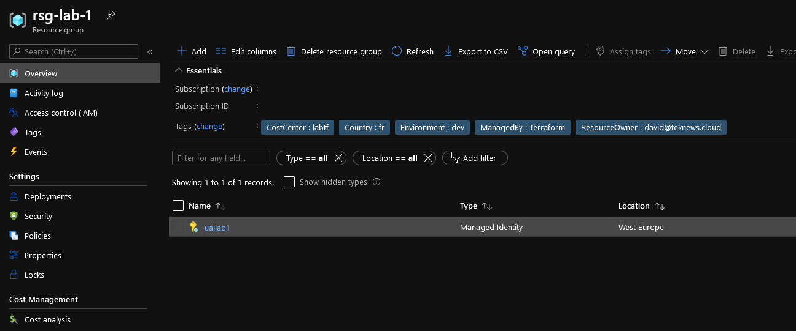

# Kubernetes User Assigned Identity

## Module description

This module deploys a User Assigned Identity, assign it a rbac builtin role and create the yaml manifest for the correspoding object in an AKS cluster with pod identity enabled


### Module inputs

| Variable name | Variable type | Default value | Description |
|:--------------|:--------------|:--------------|:------------|
| UAISuffix | string | "1" | A suffix added to the UAI name |
| TargetLocation | string | west europe | The Azure region for the resource |
| TargetRG | string | N/A | The resource group in which the resources will be deployed |
| ResourceOwnerTag | string | That would be me | Tag describing the owner |
| CountryTag | string | fr | Tag describing the Country |
| CostCenterTag | string | tflab | Tag describing the Cost Center |
| Company | string | dfitc | The Company owner of the resources |
| Project | string | tfmodule | The name of the project |
| Environment | string | dev | The environment, dev, prod... |
| RBACScope | string | N/A | The scope at which the Role Assignment applies to, such as /subscriptions/0b1f6471-1bf0-4dda-aec3-111122223333, /subscriptions/0b1f6471-1bf0-4dda-aec3-111122223333/resourceGroups/myGroup, or /subscriptions/0b1f6471-1bf0-4dda-aec3-111122223333/resourceGroups/myGroup/providers/Microsoft.Compute/virtualMachines/myVM, or /providers/Microsoft.Management/managementGroups/myMG. Changing this forces a new resource to be created. |
| BuiltinRoleName | string | N/A | The name of a built-in Role. Changing this forces a new resource to be created. Conflicts with role_definition_id. Refer to https://docs.microsoft.com/en-us/azure/role-based-access-control/built-in-roles for list of built in roles |
| ObjectId | string | N/A | The ID of the Principal (User, Group or Service Principal) to assign the Role Definition to. Changing this forces a new resource to be created. |  
  


### Module outputs

| Output name | value | Description |
|:------------|:------|:------------|
| FullUAIOutput | `azurerm_user_assigned_identity.terraUAI` |send all the resource information available in the output. In future version, this may be the only output and detailed information will probably be queried specifically from the root module |
| Id | `azurerm_user_assigned_identity.terraUAI.id` | The resource id of the UAI |
| Name | `azurerm_user_assigned_identity.terraUAI.name` | The name of the UAI |
| Location | `azurerm_user_assigned_identity.terraUAI.location` | The region in which the resource are deployed |
| RG | `azurerm_user_assigned_identity.terraUAI.resource_group_name` | The region in which the resource are deployed |
| PrincipalId | `azurerm_user_assigned_identity.terraUAI.principal_id` | The principal Id of the UAI |
| ClientId | `azurerm_user_assigned_identity.terraUAI.client_id` | The client id of the UAI |
| RBACAssignmentFull | `azurerm_role_assignment.TerraAssignedBuiltin` | send all the resource information available in the output. In future version, this may be the only output and detailed informtion will probably be queried specifically from the root module |
| RBACAssignmentGuid | `azurerm_role_assignment.TerraAssignedBuiltin.name` | The resource name |
| RBACAssignmentScope | `azurerm_role_assignment.TerraAssignedBuiltin.scope` | The scope of the assignment |
| RBACAssignmentRoleName | `azurerm_role_assignment.TerraAssignedBuiltin.role_definition_name` | The name of the RBAC Role |
| RBACAssignmentPrincipalId | `azurerm_role_assignment.TerraAssignedBuiltin.principal_id` | The principal Id of the principal assigned to the role |
| RBACAssignmentId | `azurerm_role_assignment.TerraAssignedBuiltin.id` | The resource Id |
| RBACAssignmentPrincipalType | `azurerm_role_assignment.TerraAssignedBuiltin.principal_type` | The type of principal assigned to the role |

  
  

## How to call the module
 

Use as follow:

```bash

# Creating the ResourceGroup

module "ResourceGroup" {

  #Module Location
  source                             = "github.com/dfrappart/Terra-AZModuletest//Modules_building_blocks//003_ResourceGroup/"
  #Module variable
  RGSuffix                           = "-lab-1"
  RGLocation                         = "westeurope"
  ResourceOwnerTag                   = "david@teknews.cloud"
  CountryTag                         = "fr"
  CostCenterTag                      = "labtf"
  EnvironmentTag                     = "dev"

}

module "UAI1" {

  #Module Location
  source                                  = "../../../Custom_Modules/Kube_UAI/"

  #Module variable
  UAISuffix                               = "lab1"
  TargetLocation                          = module.ResourceGroup.RGLocation
  TargetRG                                = module.ResourceGroup.RGName
  RBACScope                               = module.ResourceGroup.RGId
  BuiltinRoleName                         = "Reader"
  ResourceOwnerTag                        = var.ResourceOwnerTag
  CountryTag                              = var.CountryTag
  CostCenterTag                           = var.CostCenterTag
  Environment                             = var.Environment
  Project                                 = var.Project


}

```

## Sample display

terraform plan should gives the following output:

```powershell

An execution plan has been generated and is shown below.  
Resource actions are indicated with the following symbols:
  + create

Terraform will perform the following actions:

  # module.UAI1.azurerm_role_assignment.TerraAssignedBuiltin will be created
  + resource "azurerm_role_assignment" "TerraAssignedBuiltin" {
      + id                               = (known after apply)
      + name                             = (known after apply)
      + principal_id                     = (known after apply)
      + principal_type                   = (known after apply)
      + role_definition_id               = (known after apply)
      + role_definition_name             = "Reader"
      + scope                            = "/subscriptions/xxxxxxxx-xxxx-xxxx-xxxx-xxxxxxxxxxxx/resourceGroups/rsglabmeetup"
      + skip_service_principal_aad_check = (known after apply)
    }

  # module.UAI1.azurerm_user_assigned_identity.terraUAI will be created
  + resource "azurerm_user_assigned_identity" "terraUAI" {
      + client_id           = (known after apply)
      + id                  = (known after apply)
      + location            = "westeurope"
      + name                = "uailab1"
      + principal_id        = (known after apply)
      + resource_group_name = "rsglabmeetup"
      + tags                = {
          + "CostCenter"    = "labaks"
          + "Country"       = "fr"
          + "Environment"   = "lab"
          + "ManagedBy"     = "Terraform"
          + "Project"       = "aksmeetup"
          + "ResourceOwner" = "That would be me"
        }
    }

Plan: 2 to add, 0 to change, 0 to destroy.

Changes to Outputs:
  ~ UAI1_ClientId                    = (sensitive value)
  ~ UAI1_FullUAIOutput               = (sensitive value)
  ~ UAI1_Id                          = (sensitive value)
  ~ UAI1_PrincipalId                 = (sensitive value)
  ~ UAI1_RBACAssignmentFull          = (sensitive value)
  ~ UAI1_RBACAssignmentGuid          = "xxxxxxxx-xxxx-xxxx-xxxx-xxxxxxxxxxxx" -> (known after apply)
  ~ UAI1_RBACAssignmentId            = "/subscriptions/xxxxxxxx-xxxx-xxxx-xxxx-xxxxxxxxxxxx/resourceGroups/rsglabmeetup/providers/Microsoft.Authorization/roleAssignments/xxxxxxxx-xxxx-xxxx-xxxx-xxxxxxxxxxxx" -> (known after apply)
  ~ UAI1_RBACAssignmentPrincipalId   = (sensitive value)
  ~ UAI1_RBACAssignmentPrincipalType = "ServicePrincipal" -> (known after apply)
  ~ UAI1_podidentitymanifest         = <<-EOT
        apiVersion: "aadpodidentity.k8s.io/v1"
        kind: AzureIdentity
        metadata:
          name: uailab1
        spec:
          type: 0
          resourceID: /subscriptions/xxxxxxxx-xxxx-xxxx-xxxx-xxxxxxxxxxxx/resourceGroups/rsglabmeetup/providers/Microsoft.ManagedIdentity/userAssignedIdentities/uailab1
          clientID: xxxxxxxx-xxxx-xxxx-xxxx-xxxxxxxxxxxx
    EOT -> (known after apply)

------------------------------------------------------------------------

Note: You didn't specify an "-out" parameter to save this plan, so Terraform
can't guarantee that exactly these actions will be performed if
"terraform apply" is subsequently run.


```

Output should be similar to this:

```powershell

Apply complete! Resources: 2 added, 0 changed, 0 destroyed.

Outputs:

========================Truncated=============================
UAI1_ClientId = <sensitive>
UAI1_FullUAIOutput = <sensitive>
UAI1_Id = <sensitive>
UAI1_Location = "westeurope"
UAI1_Name = "uailab1"
UAI1_PrincipalId = <sensitive>
UAI1_RBACAssignmentFull = <sensitive>
UAI1_RBACAssignmentGuid = "xxxxxxxx-xxxx-xxxx-xxxx-xxxxxxxxxxxx"
UAI1_RBACAssignmentId = "/subscriptions/xxxxxxxx-xxxx-xxxx-xxxx-xxxxxxxxxxxx/resourceGroups/rsglabmeetup/providers/Microsoft.Authorization/roleAssignments/xxxxxxxx-xxxx-xxxx-xxxx-xxxxxxxxxxxx"
UAI1_RBACAssignmentPrincipalId = <sensitive>
UAI1_RBACAssignmentPrincipalType = "ServicePrincipal"
UAI1_RBACAssignmentRoleName = "Reader"
UAI1_RBACAssignmentScope = "/subscriptions/xxxxxxxx-xxxx-xxxx-xxxx-xxxxxxxxxxxx/resourceGroups/rsglabmeetup"
UAI1_RG = "rsglabmeetup"
UAI1_podidentitybindingmanifest = <<EOT
apiVersion: "aadpodidentity.k8s.io/v1"
metadata:
  name: uailab1-binding
spec:
  azureIdentity: uailab1
  selector: uailab1-binding
EOT
UAI1_podidentitymanifest = <<EOT
apiVersion: "aadpodidentity.k8s.io/v1"
kind: AzureIdentity
  name: uailab1
spec:
  type: 0
  resourceID: /subscriptions/xxxxxxxx-xxxx-xxxx-xxxx-xxxxxxxxxxxx/resourceGroups/rsglabmeetup/providers/Microsoft.ManagedIdentity/userAssignedIdentities/uailab1
  clientID: xxxxxxxx-xxxx-xxxx-xxxx-xxxxxxxxxxxx
EOT

```

## Sample deployment

After deployment, something simlilar is visible in the portal:




Also, the output podidentitybindingmanifest should display something similar to this: 

```bash

PS C:\Users\user1\> terraform output UAI1_podidentitybindingmanifest
<<EOT
apiVersion: "aadpodidentity.k8s.io/v1"
kind: AzureIdentityBinding
metadata:
  name: uailab1-binding
spec:
  azureIdentity: uailab1
  selector: uailab1-binding
EOT

```
And the output should display something like this: 

```bash

PS C:\Users\user1\> terraform output UAI1_podidentitymanifest
<<EOT
apiVersion: "aadpodidentity.k8s.io/v1"
kind: AzureIdentity
metadata:
  name: uailab1
spec:
  type: 0
  resourceID: /subscriptions/xxxxxxxx-xxxx-xxxx-xxxx-xxxxxxxxxxxx/resourceGroups/rsglabmeetup/providers/Microsoft.ManagedIdentity/userAssignedIdentities/uailab1
  clientID: xxxxxxxx-xxxx-xxxx-xxxx-xxxxxxxxxxxx
EOT

```

Adding the resources as follow, the yaml manifest are generated and can be used for deployment of the resources in kubernetes cluster: 

```bash

resource "local_file" "podidentitymanifest" {
  content                                 = module.UAI1.podidentitymanifest
  filename                                = "../02_PodIdentity_Yaml/${module.UAI1.Name}.yaml"
}

resource "local_file" "podidentitybindingmanifest" {
  content                                 = module.UAI1.podidentitybindingmanifest
  filename                                = "../02_PodIdentity_Yaml/${module.UAI1.Name}_Binding.yaml"
}

```

The plan is modified accordingly: 

```bash

An execution plan has been generated and is shown below.  
Resource actions are indicated with the following symbols:
  + create

Terraform will perform the following actions:

  # local_file.podidentitybindingmanifest will be created
  + resource "local_file" "podidentitybindingmanifest" {
      + content              = <<-EOT
            apiVersion: "aadpodidentity.k8s.io/v1"
            kind: AzureIdentityBinding
            metadata:
              name: uailab1-binding
            spec:
              azureIdentity: uailab1
              selector: uailab1-binding
        EOT
      + directory_permission = "0777"
      + file_permission      = "0777"
      + filename             = "../02_PodIdentity_Yaml/uailab1_Binding.yaml"
      + id                   = (known after apply)
    }

  # local_file.podidentitymanifest will be created
  + resource "local_file" "podidentitymanifest" {
      + content              = <<-EOT
            apiVersion: "aadpodidentity.k8s.io/v1"
            kind: AzureIdentity
            metadata:
              name: uailab1
            spec:
              type: 0
              resourceID: /subscriptions/xxxxxxxx-xxxx-xxxx-xxxx-xxxxxxxxxxxx/resourceGroups/rsglabmeetup/providers/Microsoft.ManagedIdentity/userAssignedIdentities/uailab1
              clientID: xxxxxxxx-xxxx-xxxx-xxxx-xxxxxxxxxxxx
        EOT
      + directory_permission = "0777"
      + file_permission      = "0777"
      + filename             = "../02_PodIdentity_Yaml/uailab1.yaml"
      + id                   = (known after apply)
    }

Plan: 2 to add, 0 to change, 0 to destroy.

------------------------------------------------------------------------

Note: You didn't specify an "-out" parameter to save this plan, so Terraform
can't guarantee that exactly these actions will be performed if
"terraform apply" is subsequently run.

```

And 2 yaml files are generated: 

```yaml

apiVersion: "aadpodidentity.k8s.io/v1"
kind: AzureIdentityBinding
metadata:
  name: uailab1-binding
spec:
  azureIdentity: uailab1
  selector: uailab1-binding

```

```yaml

apiVersion: "aadpodidentity.k8s.io/v1"
kind: AzureIdentity
metadata:
  name: uailab1
spec:
  type: 0
  resourceID: /subscriptions/xxxxxxxx-xxxx-xxxx-xxxx-xxxxxxxxxxxx/resourceGroups/rsglabmeetup/providers/Microsoft.ManagedIdentity/userAssignedIdentities/uailab1
  clientID: xxxxxxxx-xxxx-xxxx-xxxx-xxxxxxxxxxxx

```