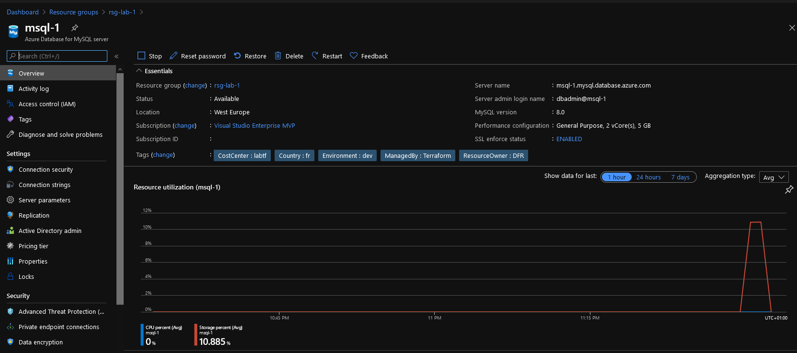
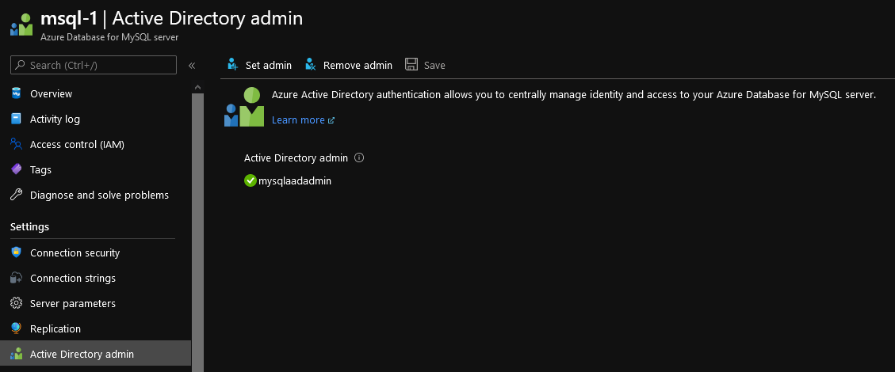
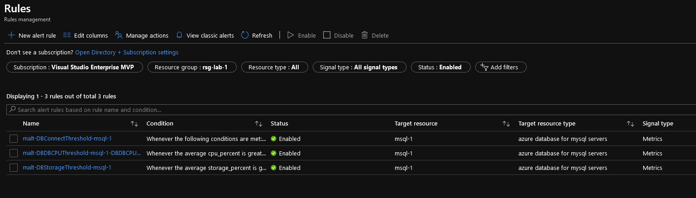
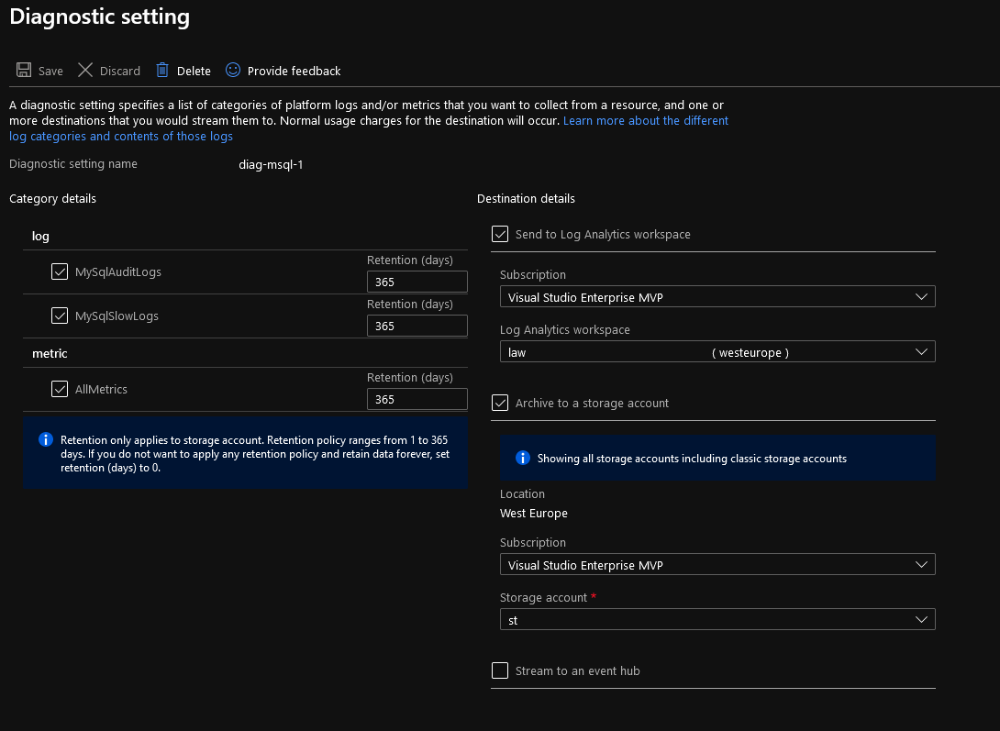
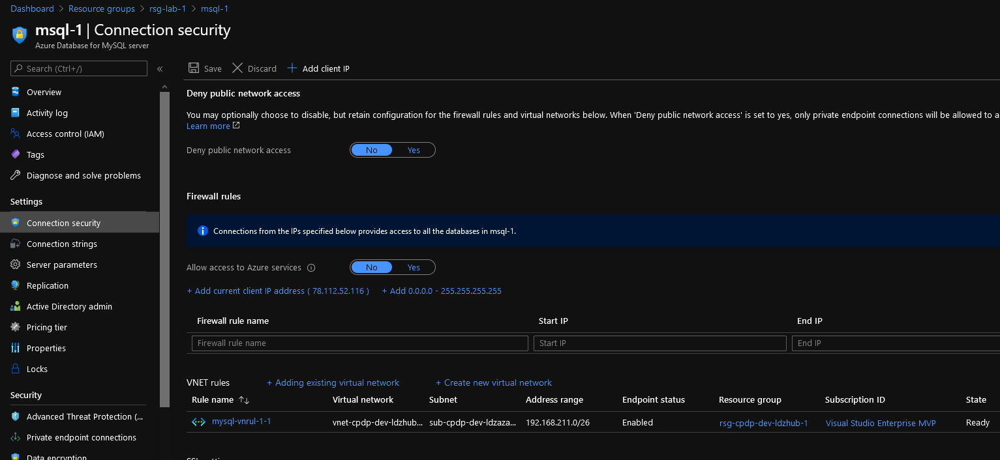

# Azure Database for MySQL Module

## Module description

This module deploys a Azure DataBase for MySQL Server.
It includes configuration for:

- Threat detection
- Azure AD Administrator
- database(s) with a count functionnality
- virtual network rules with a count functionnality

It is also configured to create Azure monitor Alert on the following metrics:

- Database connection threshold
- Database storage threshold
- Database CPU Threshold

In order to send alert, it relies on a existing Azure Action Group.

Lastly, it is configured to send diagnostic to a storage account and a log analytic workspace

## How to call the module

Use as follow:

```hcl

# Creating the ResourceGroup

module "ResourceGroup" {

  #Module Location
  source                             = "github.com/dfrappart/Terra-AZModuletest//Modules_building_blocks//003_ResourceGroup/"
  #Module variable
  RGSuffix                           = "-lab-1"
  RGLocation                         = "westeurope"
  ResourceOwnerTag                   = "DFR"
  CountryTag                         = "fr"
  CostCenterTag                      = "labtf"
  EnvironmentTag                     = "dev"

}

# Creating a random string for the root password of mysql

module "PSQLPWD" {
  #Module Location
  source                                  = "../../Modules_building_blocks/002_RandomPassword/"

  #Module variable
  stringlenght                               = 16

}

# Creating a MySQL Server

module "MySQL" {
  source                              = "../../Custom_Modules/PaaS_SRVDB_mySql"

  # Global variables
  Location                            = module.ResourceGroup.RGLocation
  RGName                              = module.ResourceGroup.RGName
  LawId                               = ""
  STAId                               = ""

  # MySQL - Globals
  MySQLSkuName                        = "GP_Gen5_2"
  MySQLVersion                        = "8.0"
  MySQLPwd                            = module.PSQLPWD.Result
  #MySql threat protection
  ThreatAlertEmail                    = [""]
  ThreatAlertTargetStorageKey         = ""
  ThreatAlertTargetEP                 = ""
  
  MySQLADAdminObjectId                = ""
  
  SubnetIds                           = ["/subscriptions/xxxxxxxx-xxxx-xxxx-xxxx-xxxxxxxxxxxx/resourceGroups/rsg-cpdp-dev-ldzhub-1/providers/Microsoft.Network/virtualNetworks/vnet-cpdp-dev-ldzhub-1/subnets/sub-cpdp-dev-ldzazadds"]

  # Monitoring

  ACG1Id                              = module.ProjectMonitoringACG.ACGId

  # Tags
    ResourceOwnerTag                  = "DFR"
    CountryTag                        = "fr"
    CostCenterTag                     = "labtf"
    EnvironmentTag                    = "dev"

}

#Action Group for monitoring

module "ProjectMonitoringACG" {

  #Module Location
  source                              = "../../Modules_building_blocks/520_ActionGroup/"

  #Module variable
  acgsuffix                           = 1
  TargetRG                            = module.ResourceGroup.RGName
  ActionGroupContact                  = ""
  TeamChannelAddress                  = ""
  
  ResourceOwnerTag                    = "DFR"
  CountryTag                          = "fr"
  CostCenterTag                       = "labtf"
  EnvironmentTag                      = "dev"


}

```

## Sample display

terraform plan should gives the following output:

```powershell

PS C:\Users\davidfrappart\Documents\IaC\Azure\Terra-AZModuletest\Tests\RG> terraform plan
Refreshing Terraform state in-memory prior to plan...
The refreshed state will be used to calculate this plan, but will not be
persisted to local or remote state storage.

module.MySQL.data.azurerm_resource_group.RGLogs: Refreshing state...
module.MySQL.data.azurerm_subscription.current: Refreshing state...
module.MySQL.data.azurerm_log_analytics_workspace.LawSubLog: Refreshing state...
module.MySQL.data.azurerm_storage_account.STASubLog: Refreshing state...

------------------------------------------------------------------------

An execution plan has been generated and is shown below.
Resource actions are indicated with the following symbols:
  + create

Terraform will perform the following actions:

  # module.MySQL.azurerm_monitor_diagnostic_setting.AzureMSQLDiag will be created
  + resource "azurerm_monitor_diagnostic_setting" "AzureMSQLDiag" {
      + id                         = (known after apply)
      + log_analytics_workspace_id = "/subscriptions/xxxxxxxx-xxxx-xxxx-xxxx-xxxxxxxxxxxx/resourcegroups/rsg-cpdp-dev-subsetup-log/providers/microsoft.operationalinsights/workspaces/law-cpdp-dev-subsetup-log49816259"
      + name                       = "diag-msql-1"
      + storage_account_id         = "/subscriptions/xxxxxxxx-xxxx-xxxx-xxxx-xxxxxxxxxxxx/resourceGroups/rsg-cpdp-dev-subsetup-log/providers/Microsoft.Storage/storageAccounts/stcpdpdev49816259log"
      + target_resource_id         = (known after apply)

      + log {
          + category = "MySqlAuditLogs"
          + enabled  = true

          + retention_policy {
              + days    = 365
              + enabled = true
            }
        }
      + log {
          + category = "MySqlSlowLogs"
          + enabled  = true

          + retention_policy {
              + days    = 365
              + enabled = true
            }
        }

      + metric {
          + category = "AllMetrics"
          + enabled  = true

          + retention_policy {
              + days    = 365
              + enabled = true
            }
        }
    }

  # module.MySQL.azurerm_monitor_metric_alert.DBCPU will be created
  + resource "azurerm_monitor_metric_alert" "DBCPU" {
      + auto_mitigate            = true
      + description              = "msql-1-DBDBCPUThreshold"
      + enabled                  = true
      + frequency                = "PT1M"
      + id                       = (known after apply)
      + name                     = "malt-DBDBCPUThreshold-msql-1-DBDBCPUThreshold"
      + resource_group_name      = "rsg-lab-1"
      + scopes                   = (known after apply)
      + severity                 = 3
      + tags                     = {
          + "CostCenter"    = "labtf"
          + "Country"       = "fr"
          + "Environment"   = "dev"
          + "ManagedBy"     = "Terraform"
          + "ResourceOwner" = "DFR"
        }
      + target_resource_location = (known after apply)
      + target_resource_type     = (known after apply)
      + window_size              = "PT1M"

      + action {
          + action_group_id = (known after apply)
        }

      + criteria {
          + aggregation      = "Average"
          + metric_name      = "cpu_percent"
          + metric_namespace = "Microsoft.DBforMySQL/servers"
          + operator         = "GreaterThan"
          + threshold        = 80
        }
    }

  # module.MySQL.azurerm_monitor_metric_alert.DBConnectThreshold will be created
  + resource "azurerm_monitor_metric_alert" "DBConnectThreshold" {
      + auto_mitigate            = true
      + description              = "msql-1-DBConnectThreshold"
      + enabled                  = true
      + frequency                = "PT1M"
      + id                       = (known after apply)
      + name                     = "malt-DBConnectThreshold-msql-1"
      + resource_group_name      = "rsg-lab-1"
      + scopes                   = (known after apply)
      + severity                 = 3
      + tags                     = {
          + "CostCenter"    = "labtf"
          + "Country"       = "fr"
          + "Environment"   = "dev"
          + "ManagedBy"     = "Terraform"
          + "ResourceOwner" = "DFR"
        }
      + target_resource_location = (known after apply)
      + target_resource_type     = (known after apply)
      + window_size              = "PT1M"

      + action {
          + action_group_id = (known after apply)
        }

      + criteria {
          + aggregation      = "Average"
          + metric_name      = "active_connections"
          + metric_namespace = "Microsoft.DBforMySQL/servers"
          + operator         = "Equals"
          + threshold        = 3
        }
      + criteria {
          + aggregation      = "Average"
          + metric_name      = "active_connections"
          + metric_namespace = "Microsoft.DBforMySQL/servers"
          + operator         = "GreaterThan"
          + threshold        = 200
        }
      + criteria {
          + aggregation      = "Total"
          + metric_name      = "connections_failed"
          + metric_namespace = "Microsoft.DBforMySQL/servers"
          + operator         = "GreaterThan"
          + threshold        = 10
        }
    }

  # module.MySQL.azurerm_monitor_metric_alert.DBStorage will be created
  + resource "azurerm_monitor_metric_alert" "DBStorage" {
      + auto_mitigate            = true
      + description              = "msql-1-DBStorageThreshold"
      + enabled                  = true
      + frequency                = "PT1M"
      + id                       = (known after apply)
      + name                     = "malt-DBStorageThreshold-msql-1"
      + resource_group_name      = "rsg-lab-1"
      + scopes                   = (known after apply)
      + severity                 = 3
      + tags                     = {
          + "CostCenter"    = "labtf"
          + "Country"       = "fr"
          + "Environment"   = "dev"
          + "ManagedBy"     = "Terraform"
          + "ResourceOwner" = "DFR"
        }
      + target_resource_location = (known after apply)
      + target_resource_type     = (known after apply)
      + window_size              = "PT1M"

      + action {
          + action_group_id = (known after apply)
        }

      + criteria {
          + aggregation      = "Average"
          + metric_name      = "storage_percent"
          + metric_namespace = "Microsoft.DBforMySQL/servers"
          + operator         = "GreaterThan"
          + threshold        = 80
        }
    }

  # module.MySQL.azurerm_mysql_active_directory_administrator.MySQLServerADAdmin will be created
  + resource "azurerm_mysql_active_directory_administrator" "MySQLServerADAdmin" {
      + id                  = (known after apply)
      + login               = "mysqlaadadmin"
      + object_id           = "xxxxxxxx-xxxx-xxxx-xxxx-xxxxxxxxxxxx"
      + resource_group_name = "rsg-lab-1"
      + server_name         = "msql-1"
      + tenant_id           = "xxxxxxxx-xxxx-xxxx-xxxx-xxxxxxxxxxxx"
    }

  # module.MySQL.azurerm_mysql_database.MySQLDB[0] will be created
  + resource "azurerm_mysql_database" "MySQLDB" {
      + charset             = "latin2"
      + collation           = "latin2_general_ci"
      + id                  = (known after apply)
      + name                = "mysql-db-1-defaultdbrws"
      + resource_group_name = "rsg-lab-1"
      + server_name         = "msql-1"
    }

  # module.MySQL.azurerm_mysql_server.MySQLServer will be created
  + resource "azurerm_mysql_server" "MySQLServer" {
      + administrator_login              = "dbadmin"
      + administrator_login_password     = (sensitive value)
      + auto_grow_enabled                = (known after apply)
      + backup_retention_days            = 35
      + create_mode                      = "Default"
      + fqdn                             = (known after apply)
      + geo_redundant_backup_enabled     = (known after apply)
      + id                               = (known after apply)
      + location                         = "westeurope"
      + name                             = "msql-1"
      + public_network_access_enabled    = true
      + resource_group_name              = "rsg-lab-1"
      + sku_name                         = "GP_Gen5_2"
      + ssl_enforcement                  = (known after apply)
      + ssl_enforcement_enabled          = true
      + ssl_minimal_tls_version_enforced = "TLSEnforcementDisabled"
      + storage_mb                       = 5120
      + tags                             = {
          + "CostCenter"    = "labtf"
          + "Country"       = "fr"
          + "Environment"   = "dev"
          + "ManagedBy"     = "Terraform"
          + "ResourceOwner" = "DFR"
        }
      + version                          = "8.0"

      + storage_profile {
          + auto_grow             = (known after apply)
          + backup_retention_days = (known after apply)
          + geo_redundant_backup  = (known after apply)
          + storage_mb            = (known after apply)
        }

      + threat_detection_policy {
          + email_addresses            = [
              + "david@teknews.cloud",
            ]
          + enabled                    = true
          + retention_days             = 365
          + storage_account_access_key = (sensitive value)
          + storage_endpoint           = "https://stxxxxxlog.blob.core.windows.net/"
        }
    }

  # module.MySQL.azurerm_mysql_virtual_network_rule.MySQLServerVNetRule[0] will be created
  + resource "azurerm_mysql_virtual_network_rule" "MySQLServerVNetRule" {
      + id                  = (known after apply)
      + name                = "mysql-vnrul-1-0"
      + resource_group_name = "rsg-lab-1"
      + server_name         = "msql-1"
      + subnet_id           = "/subscriptions/xxxxxxxx-xxxx-xxxx-xxxx-xxxxxxxxxxxx/resourceGroups/rsg-cpdp-dev-ldzhub-1/providers/Microsoft.Network/virtualNetworks/vnet-cpdp-dev-ldzhub-1/subnets/sub-cpdp-dev-ldzazadds"
    }

  # module.PSQLPWD.random_password.TerraRandomPWD will be created
  + resource "random_password" "TerraRandomPWD" {
      + id          = (known after apply)
      + length      = 16
      + lower       = true
      + min_lower   = 0
      + min_numeric = 0
      + min_special = 0
      + min_upper   = 0
      + number      = true
      + result      = (sensitive value)
      + special     = true
      + upper       = true
    }

  # module.ProjectMonitoringACG.azurerm_monitor_action_group.TerraActionGroup will be created
  + resource "azurerm_monitor_action_group" "TerraActionGroup" {
      + enabled             = true
      + id                  = (known after apply)
      + name                = "acg-1"
      + resource_group_name = "rsg-lab-1"
      + short_name          = "acg1"
      + tags                = {
          + "CostCenter"    = "labtf"
          + "Country"       = "fr"
          + "Environment"   = "dev"
          + "ManagedBy"     = "Terraform"
          + "ResourceOwner" = "DFR"
        }

      + email_receiver {
          + email_address = ""
          + name          = "senttosubcontactlist"
        }
      + email_receiver {
          + email_address = ""
          + name          = "senttoteams"
        }
    }

  # module.ResourceGroup.azurerm_resource_group.TerraRG will be created
  + resource "azurerm_resource_group" "TerraRG" {
      + id       = (known after apply)
      + location = "westeurope"
      + name     = "rsg-lab-1"
      + tags     = {
          + "CostCenter"    = "labtf"
          + "Country"       = "fr"
          + "Environment"   = "dev"
          + "ManagedBy"     = "Terraform"
          + "ResourceOwner" = "DFR"
        }
    }

Plan: 11 to add, 0 to change, 0 to destroy.

------------------------------------------------------------------------

Note: You didn't specify an "-out" parameter to save this plan, so Terraform
can't guarantee that exactly these actions will be performed if
"terraform apply" is subsequently run.

```

output should be similar to this:

```powershell

Apply complete! Resources: 11 added, 0 changed, 0 destroyed.

Outputs:

DBId = <sensitive>
MySQLADADminId = <sensitive>
MySQLADADminLogin = mysqlaadadmin
RGId = <sensitive>
RGLocation = westeurope
RGName = rsg-lab-1
RetentionDays = 35
ServerFQDN = msql-1.mysql.database.azure.com
ServerId = <sensitive>
ServerName = msql-1
ServerVersion = 8.0
SkuName = GP_Gen5_2
SslEnforcementEnabled = true
Storage = 5120

```

## Sample deployment

After deployment, something simlilar is visible in the portal:










