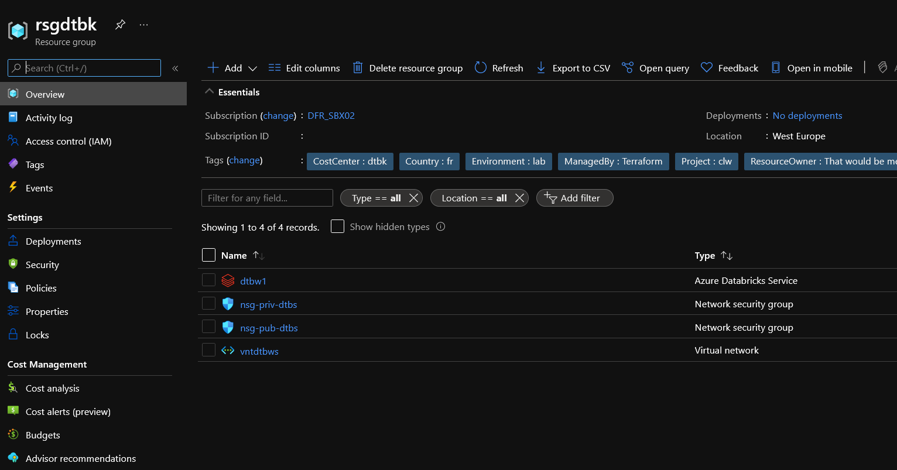
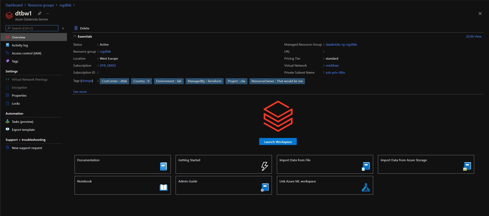
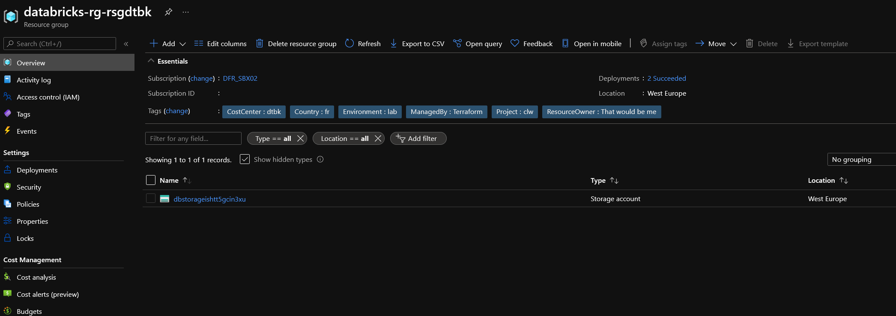
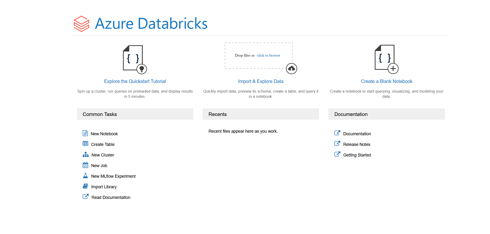

# Azure Databricks workspace module

## Module description

This module allows the deployment of an Azure Databricks workspace integraeted in a virtual network.
It includes the following resources: 

|Resources type | Resources usage |
|-|-|
| Virtual Network | Host the Databricks cluster |
| Virtual Network diagnostic settings | Configure diagnostic settings for the virtual network |
| Subnet | Databricks front subnet. Required by default for databricks workspace provisioning. Configured with delegation to Azure databricks |
| Subnet | Databricks back subnet. Required by default for databricks workspace provisioning. Configured with delegation to Azure databricks |
| NSG Front Subnet | NSG for public databricks workspace subnet. Required for provisioning |
| NSG Back Subnet | NSG for private databricks workspace subnet. Required for provisioning |
| NSG Front Subnet diagnostic settings| NSG for public databricks workspace subnet. Required a storage account and a log analytics workspace to store the logs |
| NSG Back Subnet diagnostic settings | NSG for private databricks workspace subnet.Required a storage account and a log analytics workspace to store the logs |
| NSG Front Subnet flow logs | NSG flow logs for public databricks workspace subnet. Required a storage account and a log analytics workspace to store the logs |
| NSG Back Subnet flow logs | NSG flow logs for private databricks workspace subnet. Required a storage account and a log analytics workspace to store the logs |
| Databricks workspace | PRovide the Databricks workspace |

### Module inputs

| Variable name | Variable type | Default value | Description |
|:--------------|:--------------|:--------------|:------------|
| STALogId | string | N/A | Id of the the storage account containing the logs |
| LawLogId | string | N/A | Id of the log analytic workspace containing the logs |
| LawLogWorkspaceId | string | westeurope | The log analytic workspace guid |
| LawLogLocation | string | westeurope | The log analytic workspace location |
| NetworkWatcherName | string | "NetworkWatcher_westeurope" | The name of the network watcher instance |
| NetworkWatcherRGName | string | "NetworkWatcherRG" | The name of the network watcher resource group |
| TargetRG | string | N/A | The Resource Group containing all the resources for this module |
| AzureRegion | string | "westeurope" | The Azure location |
| VNetSuffix | string | "dtbws" | A suffix for the Vnet name |
| VNetAddressSpace | list | ["192.168.102.0/24"] | The VNet IP Range |
| SubnetNames | list | ["pub-dtbs","priv-dtbs"] |A list of subnet names |
| Subnetaddressprefix | list | ["default"] | A list for the subnet address prefixes |
| SVCEP | list | null | The list of service endpoint for the subnets |
| DTBWSSuffix | string | "1" | A suffix for the Databricks workspace |
| DTBWSSku | string | "standard" | The sku of the Databricks workspace |
| DTBWSPIP | string | false | Define the dtbws param no_public_ip, default to false to have public ip |
| ResourceOwnerTag | string | "That would be me" | Tag describing the owner |
| CountryTag | string | "fr" | Tag describing the Country |
| CostCenterTag | string | "lab" | Tag describing the Cost Center |
| Project | string | "tfmodule" | The name of the project |
| Environment | string | "lab" | The environment, dev, prod... |


### Module outputs

| Output name | Value | Description | Sensitive |
|-|-|-|-|
| VNetName | `azurerm_virtual_network.VNet.name` | The name of the vnet | false |
| VNetId | `azurerm_virtual_network.VNet.id` | The id of the vnet | true |
| VNetAddressSpace | `azurerm_virtual_network.VNet.address_space` |The address space of the vnet | false |
| VNetRGName | `azurerm_virtual_network.VNet.resource_group_name` | The resource group name of the vnet | false | 
| VNetLocation | `azurerm_virtual_network.VNet.location` | The location of the vnet | false |
| VNetFull | `azurerm_virtual_network.VNet` | The full output of the vnet | true |
| SubnetNames | `azurerm_subnet.Subnet[*].name` | The subnets names list | false |
| SubnetIds | `azurerm_subnet.Subnet[*].id` | The subnets Ids list | true |
| SubnetAddressPrefixes | `azurerm_subnet.Subnet[*].address_prefixes` | The subnets address prefixes list | false | 
| SubnetFull | `azurerm_subnet.Subnet[*]` | The full output of the subnets | true | 
| NSGNames | `azurerm_network_security_group.NSG[*].name` | The NSG names list | false | 
| NSGIds |  `azurerm_network_security_group.NSG[*].id` | The NSG Ids list | true |
| NSGFull | `azurerm_network_security_group.NSG[*]` | The NSG Full output | true |
| DTBSWFull | `azurerm_databricks_workspace.DTBWS` | The Databricks workspace full output | true | 
| DTBSWId | `azurerm_databricks_workspace.DTBWS.id` | The databricks workspace Id | true |  
| DTBSWManagedRGId | `azurerm_databricks_workspace.DTBWS.managed_resource_group_id` | The Databricks resource group | false | 
| DTBSWName | `azurerm_databricks_workspace.DTBWS.name` | The Databricks worskspace name | false |

## Exemple configuration

Deploy the following to have a working databricks workspace:

```bash


# Creating the Resource Group

module "ResourceGroup" {

  #Module Location
  source                                  = "github.com/dfrappart/Terra-AZModuletest//Modules_building_blocks//003_ResourceGroup/"
  #Module variable      
  RGSuffix                                = var.ResourcesSuffix
  RGLocation                              = var.AzureRegion
  ResourceOwnerTag                        = var.ResourceOwnerTag
  CountryTag                              = var.CountryTag
  CostCenterTag                           = var.CostCenterTag
  EnvironmentTag                          = var.Environment
  Project                                 = var.Project

}

# Creating the Databricks workspace

module "DTBWS" {

  #Module Location
  source                                  = "../Modules/PaaS_VNetIntegrateddDatabrick"
  #Module variable      
  TargetRG                                = module.ResourceGroup.RGFull.name
  AzureRegion                             = module.ResourceGroup.RGFull.location
  STALogId                                = data.azurerm_storage_account.STALog.id
  LawLogId                                = data.azurerm_log_analytics_workspace.LAWLog.id
  LawLogLocation                          = data.azurerm_log_analytics_workspace.LAWLog.location
  LawLogWorkspaceId                       = data.azurerm_log_analytics_workspace.LAWLog.workspace_id
  ResourceOwnerTag                        = var.ResourceOwnerTag
  CountryTag                              = var.CountryTag
  CostCenterTag                           = var.CostCenterTag
  Environment                             = var.Environment
  Project                                 = var.Project

}

```

## Sample display

terraform plan should gives the following output:

```powershell

Acquiring state lock. This may take a few moments...

Terraform used the selected providers to generate the following execution plan. Resource actions are indicated with the following symbols:
  + create

Terraform will perform the following actions:

  # module.DTBWS.azurerm_databricks_workspace.DTBWS will be created
  + resource "azurerm_databricks_workspace" "DTBWS" {
      + id                          = (known after apply)
      + location                    = "westeurope"
      + managed_resource_group_id   = (known after apply)
      + managed_resource_group_name = (known after apply)
      + name                        = "dtbw1"
      + resource_group_name         = "rsgdtbk"
      + sku                         = "standard"
      + tags                        = {
          + "CostCenter"    = "dtbk"
          + "Country"       = "fr"
          + "Environment"   = "lab"
          + "ManagedBy"     = "Terraform"
          + "Project"       = "clw"
          + "ResourceOwner" = "That would be me"
        }
      + workspace_id                = (known after apply)
      + workspace_url               = (known after apply)

      + custom_parameters {
          + no_public_ip        = false
          + private_subnet_name = "sub-priv-dtbs"
          + public_subnet_name  = "sub-pub-dtbs"
          + virtual_network_id  = (known after apply)
        }
    }

  # module.DTBWS.azurerm_monitor_diagnostic_setting.NSGDiag[0] will be created
  + resource "azurerm_monitor_diagnostic_setting" "NSGDiag" {
      + id                         = (known after apply)
      + log_analytics_workspace_id = "/subscriptions/00000000-0000-0000-0000-000000000000/resourceGroups/rsg-dffr-lab-subsetuplog/providers/Microsoft.OperationalInsights/workspaces/law-dffr-lab-subsetuplogf1f020d0"
      + name                       = "diag-nsg-pub-dtbs"
      + storage_account_id         = "/subscriptions/00000000-0000-0000-0000-000000000000/resourceGroups/rsg-dffr-lab-subsetuplog/providers/Microsoft.Storage/storageAccounts/stdffrlabf1f020d0log"
      + target_resource_id         = (known after apply)

      + log {
          + category = "NetworkSecurityGroupEvent"
          + enabled  = true

          + retention_policy {
              + days    = 365
              + enabled = true
            }
        }
      + log {
          + category = "NetworkSecurityGroupRuleCounter"
          + enabled  = true

          + retention_policy {
              + days    = 365
              + enabled = true
            }
        }
    }

  # module.DTBWS.azurerm_monitor_diagnostic_setting.NSGDiag[1] will be created
  + resource "azurerm_monitor_diagnostic_setting" "NSGDiag" {
      + id                         = (known after apply)
      + log_analytics_workspace_id = "/subscriptions/00000000-0000-0000-0000-000000000000/resourceGroups/rsg-dffr-lab-subsetuplog/providers/Microsoft.OperationalInsights/workspaces/law-dffr-lab-subsetuplogf1f020d0"
      + name                       = "diag-nsg-priv-dtbs"
      + storage_account_id         = "/subscriptions/00000000-0000-0000-0000-000000000000/resourceGroups/rsg-dffr-lab-subsetuplog/providers/Microsoft.Storage/storageAccounts/stdffrlabf1f020d0log"
      + target_resource_id         = (known after apply)

      + log {
          + category = "NetworkSecurityGroupEvent"
          + enabled  = true

          + retention_policy {
              + days    = 365
              + enabled = true
            }
        }
      + log {
          + category = "NetworkSecurityGroupRuleCounter"
          + enabled  = true

          + retention_policy {
              + days    = 365
              + enabled = true
            }
        }
    }

  # module.DTBWS.azurerm_monitor_diagnostic_setting.VNetDiag will be created
  + resource "azurerm_monitor_diagnostic_setting" "VNetDiag" {
      + id                         = (known after apply)
      + log_analytics_workspace_id = "/subscriptions/00000000-0000-0000-0000-000000000000/resourceGroups/rsg-dffr-lab-subsetuplog/providers/Microsoft.OperationalInsights/workspaces/law-dffr-lab-subsetuplogf1f020d0"
      + name                       = "diag-vntdtbws"
      + storage_account_id         = "/subscriptions/00000000-0000-0000-0000-000000000000/resourceGroups/rsg-dffr-lab-subsetuplog/providers/Microsoft.Storage/storageAccounts/stdffrlabf1f020d0log"
      + target_resource_id         = (known after apply)

      + log {
          + category = "VMProtectionAlerts"
          + enabled  = true

          + retention_policy {
              + days    = 365
              + enabled = true
            }
        }

      + metric {
          + category = "AllMetrics"
          + enabled  = true

          + retention_policy {
              + days    = 365
              + enabled = true
            }
        }
    }

  # module.DTBWS.azurerm_network_security_group.NSG[0] will be created
  + resource "azurerm_network_security_group" "NSG" {
      + id                  = (known after apply)
      + location            = "westeurope"
      + name                = "nsg-pub-dtbs"
      + resource_group_name = "rsgdtbk"
      + security_rule       = (known after apply)
      + tags                = {
          + "CostCenter"    = "dtbk"
          + "Country"       = "fr"
          + "Environment"   = "lab"
          + "ManagedBy"     = "Terraform"
          + "Project"       = "clw"
          + "ResourceOwner" = "That would be me"
        }
    }

  # module.DTBWS.azurerm_network_security_group.NSG[1] will be created
  + resource "azurerm_network_security_group" "NSG" {
      + id                  = (known after apply)
      + location            = "westeurope"
      + name                = "nsg-priv-dtbs"
      + resource_group_name = "rsgdtbk"
      + security_rule       = (known after apply)
      + tags                = {
          + "CostCenter"    = "dtbk"
          + "Country"       = "fr"
          + "Environment"   = "lab"
          + "ManagedBy"     = "Terraform"
          + "Project"       = "clw"
          + "ResourceOwner" = "That would be me"
        }
    }

  # module.DTBWS.azurerm_network_watcher_flow_log.SubnetNSGFlowLog[0] will be created
  + resource "azurerm_network_watcher_flow_log" "SubnetNSGFlowLog" {
      + enabled                   = true
      + id                        = (known after apply)
      + network_security_group_id = (known after apply)
      + network_watcher_name      = "NetworkWatcher_westeurope"
      + resource_group_name       = "NetworkWatcherRG"
      + storage_account_id        = "/subscriptions/00000000-0000-0000-0000-000000000000/resourceGroups/rsg-dffr-lab-subsetuplog/providers/Microsoft.Storage/storageAccounts/stdffrlabf1f020d0log"
      + version                   = 2

      + retention_policy {
          + days    = 365
          + enabled = true
        }

      + traffic_analytics {
          + enabled               = true
          + interval_in_minutes   = 10
          + workspace_id          = "00000000-0000-0000-0000-000000000000"
          + workspace_region      = "westeurope"
          + workspace_resource_id = "/subscriptions/00000000-0000-0000-0000-000000000000/resourceGroups/rsg-dffr-lab-subsetuplog/providers/Microsoft.OperationalInsights/workspaces/law-dffr-lab-subsetuplogf1f020d0"
        }
    }

  # module.DTBWS.azurerm_network_watcher_flow_log.SubnetNSGFlowLog[1] will be created
  + resource "azurerm_network_watcher_flow_log" "SubnetNSGFlowLog" {
      + enabled                   = true
      + id                        = (known after apply)
      + network_security_group_id = (known after apply)
      + network_watcher_name      = "NetworkWatcher_westeurope"
      + resource_group_name       = "NetworkWatcherRG"
      + storage_account_id        = "/subscriptions/00000000-0000-0000-0000-000000000000/resourceGroups/rsg-dffr-lab-subsetuplog/providers/Microsoft.Storage/storageAccounts/stdffrlabf1f020d0log"
      + version                   = 2

      + retention_policy {
          + days    = 365
          + enabled = true
        }

      + traffic_analytics {
          + enabled               = true
          + interval_in_minutes   = 10
          + workspace_id          = "00000000-0000-0000-0000-000000000000"
          + workspace_region      = "westeurope"
          + workspace_resource_id = "/subscriptions/00000000-0000-0000-0000-000000000000/resourceGroups/rsg-dffr-lab-subsetuplog/providers/Microsoft.OperationalInsights/workspaces/law-dffr-lab-subsetuplogf1f020d0"
        }
    }

  # module.DTBWS.azurerm_subnet.Subnet[0] will be created
  + resource "azurerm_subnet" "Subnet" {
      + address_prefix                                 = (known after apply)
      + address_prefixes                               = [
          + "192.168.102.0/25",
        ]
      + enforce_private_link_endpoint_network_policies = false
      + enforce_private_link_service_network_policies  = false
      + id                                             = (known after apply)
      + name                                           = "sub-pub-dtbs"
      + resource_group_name                            = "rsgdtbk"
      + virtual_network_name                           = "vntdtbws"

      + delegation {
          + name = "pub-dtbsdelegation"

          + service_delegation {
              + name = "Microsoft.Databricks/workspaces"
            }
        }
    }

  # module.DTBWS.azurerm_subnet.Subnet[1] will be created
  + resource "azurerm_subnet" "Subnet" {
      + address_prefix                                 = (known after apply)
      + address_prefixes                               = [
          + "192.168.102.128/25",
        ]
      + enforce_private_link_endpoint_network_policies = false
      + enforce_private_link_service_network_policies  = false
      + id                                             = (known after apply)
      + name                                           = "sub-priv-dtbs"
      + resource_group_name                            = "rsgdtbk"
      + virtual_network_name                           = "vntdtbws"

      + delegation {
          + name = "priv-dtbsdelegation"

          + service_delegation {
              + name = "Microsoft.Databricks/workspaces"
            }
        }
    }

  # module.DTBWS.azurerm_subnet_network_security_group_association.Subnet_NSG_Association[0] will be created
  + resource "azurerm_subnet_network_security_group_association" "Subnet_NSG_Association" {
      + id                        = (known after apply)
      + network_security_group_id = (known after apply)
      + subnet_id                 = (known after apply)
    }

  # module.DTBWS.azurerm_subnet_network_security_group_association.Subnet_NSG_Association[1] will be created
  + resource "azurerm_subnet_network_security_group_association" "Subnet_NSG_Association" {
      + id                        = (known after apply)
      + network_security_group_id = (known after apply)
      + subnet_id                 = (known after apply)
    }

  # module.DTBWS.azurerm_virtual_network.VNet will be created
  + resource "azurerm_virtual_network" "VNet" {
      + address_space         = [
          + "192.168.102.0/24",
        ]
      + guid                  = (known after apply)
      + id                    = (known after apply)
      + location              = "westeurope"
      + name                  = "vntdtbws"
      + resource_group_name   = "rsgdtbk"
      + subnet                = (known after apply)
      + tags                  = {
          + "CostCenter"    = "dtbk"
          + "Country"       = "fr"
          + "Environment"   = "lab"
          + "ManagedBy"     = "Terraform"
          + "Project"       = "clw"
          + "ResourceOwner" = "That would be me"
        }
      + vm_protection_enabled = false
    }

  # module.ResourceGroup.azurerm_resource_group.RG will be created
  + resource "azurerm_resource_group" "RG" {
      + id       = (known after apply)
      + location = "westeurope"
      + name     = "rsgdtbk"
      + tags     = {
          + "CostCenter"    = "dtbk"
          + "Country"       = "fr"
          + "Environment"   = "lab"
          + "ManagedBy"     = "Terraform"
          + "Project"       = "clw"
          + "ResourceOwner" = "That would be me"
        }
    }

Plan: 14 to add, 0 to change, 0 to destroy.

```

Output should be simmilar to this:

```bash

Outputs:

DTBSWFull = <sensitive>
DTBSWId = <sensitive>
DTBSWManagedRGId = "/subscriptions/00000000-0000-0000-0000-000000000000/resourceGroups/databricks-rg-rsgdtbk"
DTBSWName = "dtbw1"
NSGFull = <sensitive>
NSGIds = [
  "/subscriptions/00000000-0000-0000-0000-000000000000/resourceGroups/rsgdtbk/providers/Microsoft.Network/networkSecurityGroups/nsg-pub-dtbs",
  "/subscriptions/00000000-0000-0000-0000-000000000000/resourceGroups/rsgdtbk/providers/Microsoft.Network/networkSecurityGroups/nsg-priv-dtbs",
]
NSGNames = [
  "nsg-pub-dtbs",
  "nsg-priv-dtbs",
]
SubnetAddressPrefixes = [
  tolist([
    "192.168.102.0/25",
  ]),
  tolist([
    "192.168.102.128/25",
  ]),
]
SubnetFull = <sensitive>
SubnetIds = <sensitive>
SubnetNames = [
  "sub-pub-dtbs",
  "sub-priv-dtbs",
]
VNetAddressSpace = tolist([
  "192.168.102.0/24",
])
VNetFull = <sensitive>
VNetId = <sensitive>
VNetLocation = "westeurope"
VNetName = "vntdtbws"
VNetRGName = "rsgdtbk"

```

## Sample deployment

After deployment, something simlilar is visible in the portal:










