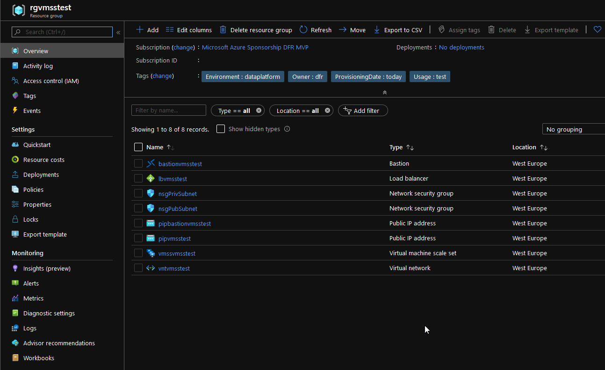

# Full VMSS Module

This module contains all Azure resource for a working VMSS exposed to the Internet

## List of resources


|Resources type | Resources usage | Additional Info |
|:--------------------|:--------------------|:----------------------------------------|
|Resource Group | Group all resources of the modules | N/A |
|Load Balancerp | External load balancer in front n the VM Scale Set | SKU Standard, which requires a NSG to allow traffic |
|Virtual Network | Virtual Network hosting the resources | N/A |
|Subnet | Front Subnet hosting the resources internet exposed through the load balancer | N/A |
|Subnet | Back End Subnet hosting the resources not directly exposed to Internet | N/A |
|Subnet | Azure Bastion dedicated subnets | Subnet called AzureBastionSubnet as a prequisite, with a minimum /26 for CIDR |
|Network Security Group | filter traffic for VMs in the internet facing subnet | N/A |
|Network Security Group | filter traffic for VMs in the Backend subnet | No VM in this subnet with the current module |
|Public IP | Public Ip for the Load Balancer | Standard SKU, Zone redundant |
|Public IP | Public Ip for the Bastion | Standard SKU, Zone redundant |
|VM Scale Set |VM Scale Set linux | Boot strapped with Cloudinit, autoscaling associated with Azure Monitor resource |
|Autoscale setting | An Azure Monitor rsource allowing the autoscaling for the VMSS | 2 rules of scaling included, one for scale out, one for scale down |


## Usage


### 1. Terraform configuration deployment - calling the module

Call the module as follow:

```hcl.js

module "vmsslinux" {
    #Module location
    source = "github.com/dfrappart/Terra-AZModuletest//Modules//53 VMScaleSet/"

    #Module variables

    RGName                              = var.RGName
    RGLocation                          = var.RGLocation
    VNetName                            = var.VNetName
    VNetAddressSpace                    = var.VNetAddressSpace
    Subnetaddressprefix                 = var.Subnetaddressprefix
    NSGName                             = var.NSGName
    PublicIPName                        = var.PublicIPName
    ExtLBName                           = var.ExtLBName
    FEConfigName                        = var.FEConfigName
    LBProbePort                         = var.LBProbePort
    LBProbeName                         = var.LBProbeName
    LBBackEndPoolName                   = var.LBBackEndPoolName
    FERuleName                          = var.FERuleName
    FERuleProtocol                      = var.FERuleProtocol
    FERuleFEPort                        = var.FERuleFEPort
    FERuleBEPort                        = var.FERuleBEPort
    CloudinitscriptPath                 = var.CloudinitscriptPath
    VMSSName                            = var.VMSSName
    VMSSSku                             = var.VMSSSku
    VMAdminName                         = var.VMAdminName
    PublicSSHKeyPath                    = var.PublicSSHKeyPath
    VMAdminPassword                     = var.VMAdminPassword
    VMImagePublisherName                = var.VMImagePublisherName
    VMImageOfferName                    = var.VMImageOfferName
    VMImageSku                          = var.VMImageSku
    VMSSInstanceNumber                  = var.VMSSInstanceNumber
    VMSSInstanceMin                     = var.VMSSInstanceMin
    VMSSInstanceMax                     = var.VMSSInstanceMax

#Tags and naming param   
    
    EnvironmentTag                      = var.EnvironmentTag
    EnvironmentUsageTag                 = var.EnvironmentUsageTag
    ProvisioningDateTag                 = var.ProvisioningDateTag
    OwnerTag                            = var.OwnerTag

}


```

Many of the variables are configured with acceptable default value. List of all variable is displayed below: 

|Variable name | Type | Description | Default value |
|:-------------|:-----|:------------|:--------------|
| RGName | string | The Resource Group containing all the resources for this module | vmsstest |
| RGLocation | string | The Azure location of the RG | westeurope |
| VNetName | string | The VNet name | vmsstest |
| VNetAddressSpace | list | The VNet IP Range | ["192.168.102.0/23"] |
| SubnetName | list | The subnet names | ["PubSubnet",                        "PrivSubnet","AzureBastionSubnet"] |
| Subnetaddressprefix | list | The subnets IP Ranges | ["192.168.102.0/26","192.168.102.64/26","192.168.102.128/26"] |
| SVCEP | string | The list of service endpoint for the subnets | null |
| NSGName | list | The list of NSG Name | ["PubSubnet","PrivSubnet"] |
| ExtLBName | string | The Load balancer name | vmsstest |
| FEConfigName | string | The Load balancer Front End configurationname | vmsstest |
| LBSku | string | The Load balancer sku, basic or standard, default to standard | standard |
| LBProbePort | string | The Load balancer Probe port | 80 |
| LBProbeName | string | The Load balancer Probe Name | vmssLBProbe |
| LBBackEndPoolName | string | The Load balancer BE Pool Name | vmssLBBEPool |
| FERuleName | string | The Load balancer FE Rule | vmssLBFERule |
| FERuleProtocol | string | The Load balancer FE Protocol | tcp |
| FERuleFEPort | string | The Load balancer FE Rule FE Port | 80 |
| CloudinitscriptPath | string | The bootstrap script path, including thename. It refers in th emodule to pathroot | /Scripts/bootstrap.sh |
| VMSSSku | string | The VMSS Instance SKU | Standard_B2ms |
| VMAdminName | string | The VMSS Admin Name| VMAdmin |
| VMAdminPassword | string | The VMSS default pwd | Password123 |
| VMImagePublisherName | string | The VMSS VM Image Publisher name | Canonical |
| VMImageOfferName | string | The VMSS VM Image Offer | UbuntuServer |
| VMImageSku | string | The VMSS VM Image SKU | 18.04-LTS |
| OSDiskTier | string | The Managed DIsk Storage Tier | Premium_LRS |
| OSDiskCaching | string | The default caching mode for the OS Disk | None |
| VMSSNICName | string | The VMSS Nic Name | vmsstest |
| VMSSNICNameConfig | string | The VMSS  IP Config Name | vmsstest |
| VMSSUpgradeMode | string | The upgrade mode of the VMSS, possible value are Manual, Rolling and Automatic | Rolling |
| VMSSZonesList | list | The list of AZ in wich the VMSS is deployed | [1,2,3] |
| IsZoneBalanced | string | If the VMSS is balanced across the AZ | true |
| VMSSPRofileName | string | The VMSS Autoscale profile name | vmssautoscaleprofile |
| VMSSInstanceNumber | string | The VMSS Instance number | 6 |
| VMSSInstanceMin | string | The VMSS Minimal Instance number | 3 |
| VMSSInstanceMax | string | The VMSS Maximal Instance number | 9 |
| ScaleUpRuleMetricName | string | The metric name for the scale out rule | Percentage CPU |
| ScaleUpRuleTimeGrain | string | The metric name for the scale out rule | PT1M |
| ScaleUpRuleStatistic | string | The statistic name for the rule scale out rule | Average |
| ScaleUpRuleTimeWindow | string | The time window for the rule scale out rule | PT5M |
| ScaleUpRuleTimeAggreg | string | The time aggregation for the rule scale out rule | Average |
| ScaleUpRuleOperator | string | The operator for the rule scale out rule | GreaterThan |
| ScaleUpRuleThreshold | string | The theshold for the rule scale out rule | 90 |
| ScaleUpActionType | string | The theshold for the rule scale out rule | ChangeCount |
| ScaleUpActionValue | string | The number of added instance in the scaleset | 3 |
| ScaleUpActionCooldown | string | The scale up cool down time value | PT1M |
| ScaleDownRuleMetricName | string | The metric name for the scale out rule | Percentage CPU |
| ScaleDownRuleTimeGrain | string | The metric name for the scale out rule | PT1M |
| ScaleDownRuleStatistic | string | The statistic name for the rule scale out rule | Average |
| ScaleDownRuleTimeWindow | string | The time window for the rule scale out rule | PT5M |
| ScaleDownRuleTimeAggreg | string | The time aggregation for the rule scale out rule | Average |
| ScaleDownRuleOperator | string | The operator for the rule scale out rule | LessThan |
| ScaleDownRuleThreshold | string | The theshold for the rule scale out rule | 25 |
| ScaleDownActionType | string | The theshold for the rule scale out rule | ChangeCount |
| ScaleDownActionValue | string | The number of added instance in the scaleset | 3 |
| ScaleDownActionCooldown | string | The scale up cool down time value | PT1M |
| EnvironmentTag | string | The scale up cool down time value | vmsstest |
| EnvironmentUsageTag | string | The scale up cool down time value | test |
| OwnerTag | string | The scale up cool down time value | That would be me |
| ProvisioningDateTag | string | The scale up cool down time value | Today :) |

### 2. Terraform configuration deployment - terraform.tfvars


Fill in the terraform.tfvars to input the value of the variables

```hcl.js

######################################################################
# config variables 
######################################################################

#Provider variable

AzureSubscriptionID                     = ""
AzureClientID                           = ""
AzureClientSecret                       = ""
AzureTenantID                           = ""


# Resources variables

    RGName                              = "vmsstest"
    RGLocation                          = "westeurope"
    VNetName                            = "vmsstest"
    VNetAddressSpace                    = [
                            "192.168.102.0/23"
                            ]

    Subnetaddressprefix                 = [
                            "192.168.102.0/26",
                            "192.168.102.64/26",
                            "192.168.102.128/26"

                            ]

    LBProbePort                         = 80
    FERuleProtocol                      = "tcp"
    FERuleFEPort                        = 80
    FERuleBEPort                        = 80
    CloudinitscriptPath                 = "/Scripts/bootstrap.sh"
    VMSSSku                             = "Standard_B2ms"
    VMAdminName                         = "VMAdmin"
    PublicSSHKeyPath                    = "/sshkey.pub"
    VMAdminPassword                     = "Password123"
    VMImagePublisherName                = "Canonical"
    VMImageOfferName                    = "UbuntuServer"
    VMImageSku                          = "18.04-LTS"

#Tags and naming paramm   
    
    EnvironmentTag                      = "dataplatform"
    EnvironmentUsageTag                 = "test"
    ProvisioningDateTag                 = "today"
    OwnerTag                            = "dfr"
    

  


```

### 3. Backend configuration

Specify the azure storage account used as a backend, which should have been created with the script configurebackend.ps1, with variables value for the authentication in a file to be stored as secret in Azure Devops:


```hcl.js

terraform {
  backend "azurerm" {
    storage_account_name = "The name of the storage account"
    container_name       = "the name of the container"
    key                  = "name of the blob to store the backend"
    access_key           = "storageaccountaccesskey"
  }
}


```


## Display after provisioning

You should have something looking like that in the Azure portal: 

