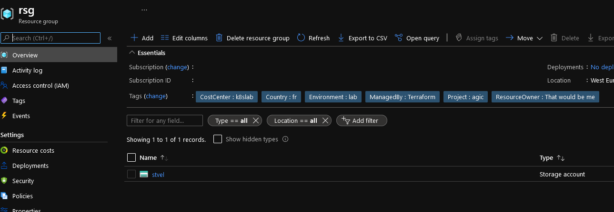

# Storage Account module

## Module description

This module assign storage account.

### Module inputs

| Variable name | Variable type | Default value | Description |
|:--------------|:--------------|:--------------|:------------|
| STASuffix | string | N/A | a suffix to add at the end of the storage account name |
| RGName | string | N/A | TThe name of the resource group in which to create the storage account. Changing this forces a new resource to be created. |
| StorageAccountLocation | string | N/A | Specifies the supported Azure location where the resource exists. Changing this forces a new resource to be created. |
| StorageAccountTier | string | Standard | Defines the Tier to use for this storage account. Valid options are Standard and Premium. For BlockBlobStorage and FileStorage accounts only Premium is valid. Changing this forces a new resource to be created. |
| StorageReplicationType | string | LRS | "Defines the type of replication to use for this storage account. Valid options are LRS, GRS, RAGRS, ZRS, GZRS and RAGZRS. |
| StorageAccessTier | string | null | Defines the access tier for BlobStorage, FileStorage and StorageV2 accounts. Valid options are Hot and Cool, defaults to Hot. |
| HTTPSSetting | string | true | Boolean flag which forces HTTPS if enabled, see here for more information. Defaults to true. |
| TLSVer | string | TLS1_2 | The minimum supported TLS version for the storage account. Possible values are TLS1_0, TLS1_1, and TLS1_2. |
| ResourceOwnerTag | string | That would be me | Tag describing the owner |
| CountryTag | string | fr | Tag describing the Country |
| CostCenterTag | string | tflab | Tag describing the Cost Center |
| Company | string | dfitc | The Company owner of the resources |
| Project | string | tfmodule | The name of the project |
| Environment | string | dev | The environment, dev, prod... |  

### Module outputs

| Output name | value | Description |
|:------------|:------|:------------|
| STAFull | `azurerm_storage_account.Terra_STOA` | send all the resource information available in the output. In future version, this may be the only output and detailed informtion will probably be queried specifically from the root module |
| Name | `azurerm_storage_account.Terra_STOA.name` | The resource name |
| Id | `azurerm_storage_account.Terra_STOA.id` | The resource Id |
| PrimaryBlobEP | `azurerm_storage_account.Terra_STOA.primary_blob_endpoint` | The primary Blob Endpoint |
| PrimaryQueueEP | `azurerm_storage_account.Terra_STOA.primary_queue_endpoint` | The primary Queue Endpoint |
| PrimaryTableEP | `azurerm_storage_account.Terra_STOA.primary_table_endpoint` | The primary Table Endpoint |
| PrimaryFileEP | `azurerm_storage_account.Terra_STOA.primary_file_endpoint` | The primary File Endpoint |
| PrimaryAccessKey | `azurerm_storage_account.Terra_STOA.primary_access_key` | The primary access key |
| SecondaryAccessKey | `azurerm_storage_account.Terra_STOA.secondary_access_key` | The secondary access key |
| ConnectionURI | `azurerm_storage_account.Terra_STOA.primary_blob_connection_string` | The blob connection string |
| RGName | `azurerm_storage_account.Terra_STOA.resource_group_name` | The primary File Endpoint |

## How to call the module
 

Use as follow:

```bash

# Creating the STA

module "STATest" {

  #Module Location
  source                                = "github.com/dfrappart/Terra-AZModuletest//Modules_building_blocks//101_StorageAccountGP"
  #Module variable    
  STASuffix                             = "cpt_data"
  RGName                                = var.RGLocation
  StorageAccountLocation                = var.ResourceOwnerTag


}


```

## Sample display

terraform plan should gives the following output:

```powershell


```

Output should be similar to this:

```powershell


```

## Sample deployment

After deployment, something simlilar is visible in the portal:



