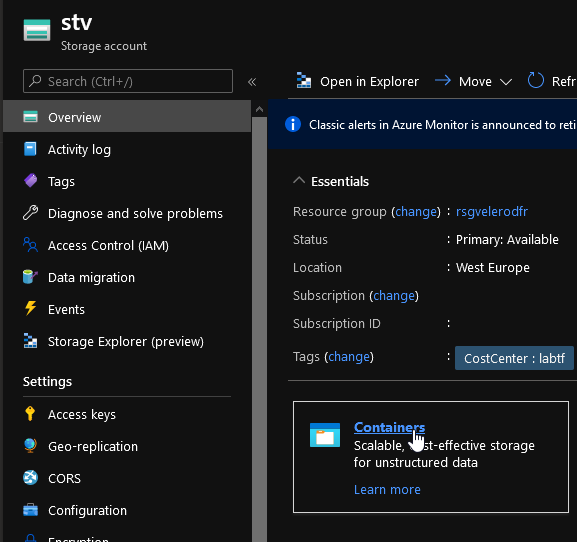
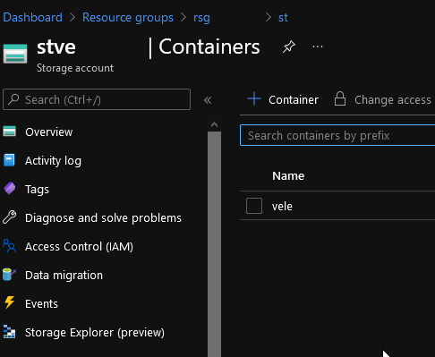

# Storage Account container module

## Module description

This module creates a container in a storage account

### Module inputs

| Variable name | Variable type | Default value | Description |
|:--------------|:--------------|:--------------|:------------|
| StorageContainerName | string | N/A | a suffix to add at the end of the storage account name |
| StorageAccountName | string | N/A | The name of the resource group in which to create the storage account. Changing this forces a new resource to be created. |
| AccessType | string | private | Specifies the supported Azure location where the resource exists. Changing this forces a new resource to be created. |


### Module outputs

| Output name | value | Description |
|:------------|:------|:------------|
| Full | `azurerm_storage_container.STC` | send all the resource information available in the output. In future version, this may be the only output and detailed informtion will probably be queried specifically from the root module |
| Name | `azurerm_storage_container.STC.name` | The resource name |
| Id | `azurerm_storage_container.STC.id` | The resource Id |
| ResourceManagerId | `azurerm_storage_container.STC.resource_manager_id` | The primary Blob Endpoint |
| ImmutabilityStatus | `azurerm_storage_container.STC.has_immutability_policy` | The immutability status of the stc |
| LegalHoldStatus | `azurerm_storage_container.STC.has_legal_hold` | The legal hold status of the stc |
| STAName | `azurerm_storage_container.STC.storage_account_name` | The storage account name in which the stc lives |


## How to call the module
 

Use as follow:

```bash

# Creating the STC

module "STATest" {

  #Module Location
  source                                = "github.com/dfrappart/Terra-AZModuletest//Modules_building_blocks//102_StorageAccountContainer"
  #Module variable    
  STASuffix                             = "cpt_data"
  RGName                                = var.RGLocation
  StorageAccountLocation                = var.ResourceOwnerTag


}


```

## Sample display

terraform plan should gives the following output:

```powershell

PS C:\Users\jubei.yagyu> terraform plan

An execution plan has been generated and is shown below.
Resource actions are indicated with the following symbols:
  + create

Terraform will perform the following actions:

  # module.STATest.azurerm_storage_container.STC will be created
  + resource "azurerm_storage_container" "STC" {
      + container_access_type   = "private"
      + has_immutability_policy = (known after apply)
      + has_legal_hold          = (known after apply)
      + id                      = (known after apply)
      + metadata                = (known after apply)
      + name                    = "test"
      + resource_manager_id     = (known after apply)
      + storage_account_name    = "sttest"
    }

Plan: 1 to add, 0 to change, 0 to destroy.

```

## Sample deployment

After deployment, something simlilar is visible in the portal:




