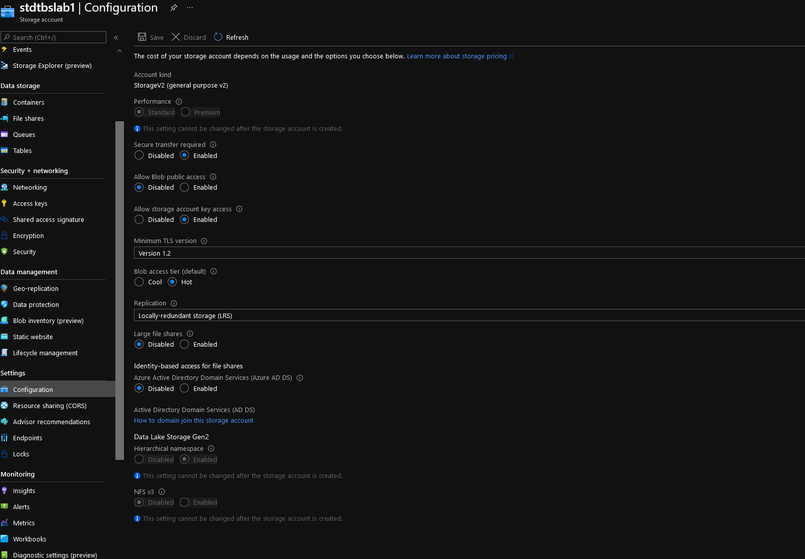
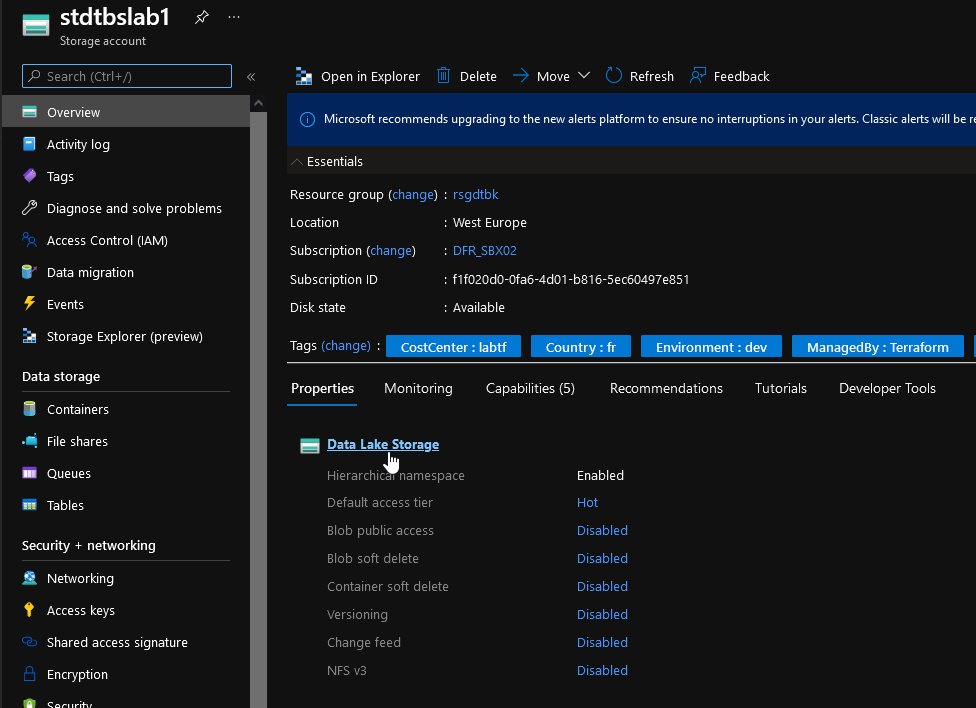
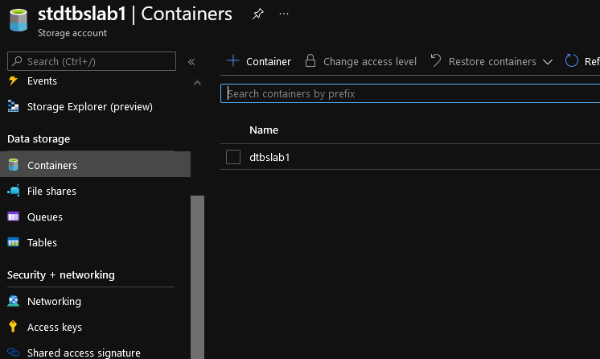

# Storage Account module

## Module description

This module deploys a file system in a storage account with hierarchical namespace enabled.

### Module inputs

| Variable name | Variable type | Default value | Description |
|:--------------|:--------------|:--------------|:------------|
| DatalakeFSName | string | N/A | The name of the Data Lake Gen2 File System which should be created within the Storage Account. Must be unique within the storage account the queue is located. Changing this forces a new resource to be created. |
| STAId | string | N/A | Specifies the ID of the Storage Account in which the Data Lake Gen2 File System should exist. Changing this forces a new resource to be created. |


### Module outputs

| Output name | value | Description |
|:------------|:------|:------------|
| STAFull | `azurerm_storage_data_lake_gen2_filesystem.Datalakev2FS` | send all the resource information available in the output. In future version, this may be the only output and detailed informtion will probably be queried specifically from the root module |

## How to call the module
 

Use as follow:

```bash


```

## Sample display

terraform plan should gives the following output:

```powershell

PS C:\Users\jubei.yagyu> terraform plan

PS C:\Users\davidfrappart\Documents\IaC\Azure\DatabricksLab\Terraformconfig\01_Infra_DatabricksWorkspace> terraform plan
================================Truncated======================================
Terraform used the selected providers to generate the following execution plan. Resource actions are indicated with the following symbols:
  + create

Terraform will perform the following actions:

  # module.STAdatalake[0].azurerm_storage_account.STOA will be created
  + resource "azurerm_storage_account" "STOA" {
      + access_tier                      = (known after apply)
      + account_kind                     = "StorageV2"
      + account_replication_type         = "LRS"
      + account_tier                     = "Standard"
      + allow_blob_public_access         = false
      + enable_https_traffic_only        = true
      + id                               = (known after apply)
      + is_hns_enabled                   = true
      + large_file_share_enabled         = (known after apply)
      + location                         = "westeurope"
      + min_tls_version                  = "TLS1_2"
      + name                             = "stdtbslab1"
      + nfsv3_enabled                    = false
      + primary_access_key               = (sensitive value)
      + primary_blob_connection_string   = (sensitive value)
      + primary_blob_endpoint            = (known after apply)
      + primary_blob_host                = (known after apply)
      + primary_connection_string        = (sensitive value)
      + primary_dfs_endpoint             = (known after apply)
      + primary_dfs_host                 = (known after apply)
      + primary_file_endpoint            = (known after apply)
      + primary_file_host                = (known after apply)
      + primary_location                 = (known after apply)
      + primary_queue_endpoint           = (known after apply)
      + primary_queue_host               = (known after apply)
      + primary_table_endpoint           = (known after apply)
      + primary_table_host               = (known after apply)
      + primary_web_endpoint             = (known after apply)
      + primary_web_host                 = (known after apply)
      + resource_group_name              = "rsgdtbk"
      + secondary_access_key             = (sensitive value)
      + secondary_blob_connection_string = (sensitive value)
      + secondary_blob_endpoint          = (known after apply)
      + secondary_blob_host              = (known after apply)
      + secondary_connection_string      = (sensitive value)
      + secondary_dfs_endpoint           = (known after apply)
      + secondary_dfs_host               = (known after apply)
      + secondary_file_endpoint          = (known after apply)
      + secondary_file_host              = (known after apply)
      + secondary_location               = (known after apply)
      + secondary_queue_endpoint         = (known after apply)
      + secondary_queue_host             = (known after apply)
      + secondary_table_endpoint         = (known after apply)
      + secondary_table_host             = (known after apply)
      + secondary_web_endpoint           = (known after apply)
      + secondary_web_host               = (known after apply)
      + tags                             = {
          + "CostCenter"    = "labtf"
          + "Country"       = "fr"
          + "Environment"   = "dev"
          + "ManagedBy"     = "Terraform"
          + "ResourceOwner" = "That would be me"
        }

      + blob_properties {
          + change_feed_enabled      = (known after apply)
          + default_service_version  = (known after apply)
          + last_access_time_enabled = (known after apply)
          + versioning_enabled       = (known after apply)

          + container_delete_retention_policy {
              + days = (known after apply)
            }

          + cors_rule {
              + allowed_headers    = (known after apply)
              + allowed_methods    = (known after apply)
              + allowed_origins    = (known after apply)
              + exposed_headers    = (known after apply)
              + max_age_in_seconds = (known after apply)
            }

          + delete_retention_policy {
              + days = (known after apply)
            }
        }

      + identity {
          + principal_id = (known after apply)
          + tenant_id    = (known after apply)
          + type         = (known after apply)
        }

      + network_rules {
          + bypass                     = (known after apply)
          + default_action             = (known after apply)
          + ip_rules                   = (known after apply)
          + virtual_network_subnet_ids = (known after apply)

          + private_link_access {
              + endpoint_resource_id = (known after apply)
              + endpoint_tenant_id   = (known after apply)
            }
        }

      + queue_properties {
          + cors_rule {
              + allowed_headers    = (known after apply)
              + allowed_methods    = (known after apply)
              + allowed_origins    = (known after apply)
              + exposed_headers    = (known after apply)
              + max_age_in_seconds = (known after apply)
            }

          + hour_metrics {
              + enabled               = (known after apply)
              + include_apis          = (known after apply)
              + retention_policy_days = (known after apply)
              + version               = (known after apply)
            }

          + logging {
              + delete                = (known after apply)
              + read                  = (known after apply)
              + retention_policy_days = (known after apply)
              + version               = (known after apply)
              + write                 = (known after apply)
            }

          + minute_metrics {
              + enabled               = (known after apply)
              + include_apis          = (known after apply)
              + retention_policy_days = (known after apply)
              + version               = (known after apply)
            }
        }

      + routing {
          + choice                      = (known after apply)
          + publish_internet_endpoints  = (known after apply)
          + publish_microsoft_endpoints = (known after apply)
        }
    }

  # module.STAdatalake[1].azurerm_storage_account.STOA will be created
  + resource "azurerm_storage_account" "STOA" {
      + access_tier                      = (known after apply)
      + account_kind                     = "StorageV2"
      + account_replication_type         = "LRS"
      + account_tier                     = "Standard"
      + allow_blob_public_access         = false
      + enable_https_traffic_only        = true
      + id                               = (known after apply)
      + is_hns_enabled                   = true
      + large_file_share_enabled         = (known after apply)
      + location                         = "westeurope"
      + min_tls_version                  = "TLS1_2"
      + name                             = "stdtbslab2"
      + nfsv3_enabled                    = false
      + primary_access_key               = (sensitive value)
      + primary_blob_connection_string   = (sensitive value)
      + primary_blob_endpoint            = (known after apply)
      + primary_blob_host                = (known after apply)
      + primary_connection_string        = (sensitive value)
      + primary_dfs_endpoint             = (known after apply)
      + primary_dfs_host                 = (known after apply)
      + primary_file_endpoint            = (known after apply)
      + primary_file_host                = (known after apply)
      + primary_location                 = (known after apply)
      + primary_queue_endpoint           = (known after apply)
      + primary_queue_host               = (known after apply)
      + primary_table_endpoint           = (known after apply)
      + primary_table_host               = (known after apply)
      + primary_web_endpoint             = (known after apply)
      + primary_web_host                 = (known after apply)
      + resource_group_name              = "rsgdtbk"
      + secondary_access_key             = (sensitive value)
      + secondary_blob_connection_string = (sensitive value)
      + secondary_blob_endpoint          = (known after apply)
      + secondary_blob_host              = (known after apply)
      + secondary_connection_string      = (sensitive value)
      + secondary_dfs_endpoint           = (known after apply)
      + secondary_dfs_host               = (known after apply)
      + secondary_file_endpoint          = (known after apply)
      + secondary_file_host              = (known after apply)
      + secondary_location               = (known after apply)
      + secondary_queue_endpoint         = (known after apply)
      + secondary_queue_host             = (known after apply)
      + secondary_table_endpoint         = (known after apply)
      + secondary_table_host             = (known after apply)
      + secondary_web_endpoint           = (known after apply)
      + secondary_web_host               = (known after apply)
      + tags                             = {
          + "CostCenter"    = "labtf"
          + "Country"       = "fr"
          + "Environment"   = "dev"
          + "ManagedBy"     = "Terraform"
          + "ResourceOwner" = "That would be me"
        }

      + blob_properties {
          + change_feed_enabled      = (known after apply)
          + default_service_version  = (known after apply)
          + last_access_time_enabled = (known after apply)
          + versioning_enabled       = (known after apply)

          + container_delete_retention_policy {
              + days = (known after apply)
            }

          + cors_rule {
              + allowed_headers    = (known after apply)
              + allowed_methods    = (known after apply)
              + allowed_origins    = (known after apply)
              + exposed_headers    = (known after apply)
              + max_age_in_seconds = (known after apply)
            }

          + delete_retention_policy {
              + days = (known after apply)
            }
        }

      + identity {
          + principal_id = (known after apply)
          + tenant_id    = (known after apply)
          + type         = (known after apply)
        }

      + network_rules {
          + bypass                     = (known after apply)
          + default_action             = (known after apply)
          + ip_rules                   = (known after apply)
          + virtual_network_subnet_ids = (known after apply)

          + private_link_access {
              + endpoint_resource_id = (known after apply)
              + endpoint_tenant_id   = (known after apply)
            }
        }

      + queue_properties {
          + cors_rule {
              + allowed_headers    = (known after apply)
              + allowed_methods    = (known after apply)
              + allowed_origins    = (known after apply)
              + exposed_headers    = (known after apply)
              + max_age_in_seconds = (known after apply)
            }

          + hour_metrics {
              + enabled               = (known after apply)
              + include_apis          = (known after apply)
              + retention_policy_days = (known after apply)
              + version               = (known after apply)
            }

          + logging {
              + delete                = (known after apply)
              + read                  = (known after apply)
              + retention_policy_days = (known after apply)
              + version               = (known after apply)
              + write                 = (known after apply)
            }

          + minute_metrics {
              + enabled               = (known after apply)
              + include_apis          = (known after apply)
              + retention_policy_days = (known after apply)
              + version               = (known after apply)
            }
        }

      + routing {
          + choice                      = (known after apply)
          + publish_internet_endpoints  = (known after apply)
          + publish_microsoft_endpoints = (known after apply)
        }
    }

  # module.datalakefilesystem[0].azurerm_storage_data_lake_gen2_filesystem.Datalakev2FS will be created
  + resource "azurerm_storage_data_lake_gen2_filesystem" "Datalakev2FS" {
      + id                 = (known after apply)
      + name               = "dtbslab1"
      + storage_account_id = (sensitive)

      + ace {
          + id          = (known after apply)
          + permissions = (known after apply)
          + scope       = (known after apply)
          + type        = (known after apply)
        }
    }

  # module.datalakefilesystem[1].azurerm_storage_data_lake_gen2_filesystem.Datalakev2FS will be created
  + resource "azurerm_storage_data_lake_gen2_filesystem" "Datalakev2FS" {
      + id                 = (known after apply)
      + name               = "dtbslab2"
      + storage_account_id = (sensitive)

      + ace {
          + id          = (known after apply)
          + permissions = (known after apply)
          + scope       = (known after apply)
          + type        = (known after apply)
        }
    }

Plan: 4 to add, 0 to change, 0 to destroy.

```


## Sample deployment

After deployment, something simlilar is visible in the portal:

  

  

  


