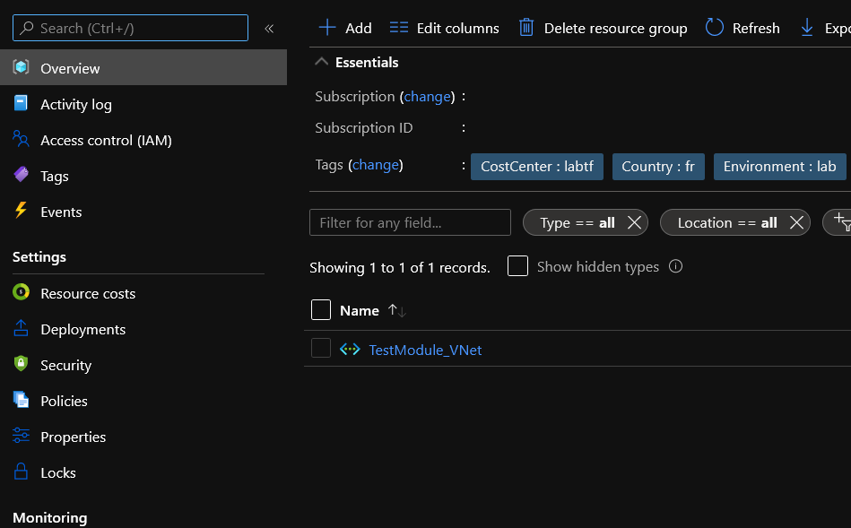

# Azure Virtual Network Module

## Module description

This module deploys an Azure Virtual Network

### Module inputs

| Variable name | Variable type | Default value | Description |
|:--------------|:--------------|:--------------|:------------|
| VNetSuffix | string | N/A | a suffix to add at the end of the storage account name |
| RGName | string | N/A | The name of the resource group in which to create the VNet. Changing this forces a new resource to be created. |
| VNetAddressSpace | list | ["10.0.0.0/20"] | The address space that is used the virtual network. You can supply more than one address space. | 
| DNSServerList | list | null | The List of IP addresses of DNS servers | 
| IsVMProtectionEnabled | string | null | Whether to enable VM protection for all the subnets in this Virtual Network. Defaults to false. | 
| ResourceOwnerTag | string | That would be me | Tag describing the owner |
| CountryTag | string | fr | Tag describing the Country |
| CostCenterTag | string | tflab | Tag describing the Cost Center |
| Project | string | tfmodule | The name of the project |
| Environment | string | dev | The environment, dev, prod... |  

### Module outputs

| Output name | value | Description |
|:------------|:------|:------------|
| Name | `azurerm_virtual_network.VNet.name`| The resource name |
| Id | `azurerm_virtual_network.VNet.id` | The resource id|
| AddressSpace | `azurerm_virtual_network.VNet.address_space` | The virtualnetwork address space|
| RGName | `azurerm_virtual_network.VNet.resource_group_name` | The resource group in which the vnet lives |
| Location | `azurerm_virtual_network.VNet.location` ||
| VnetFull |`azurerm_virtual_network.VNet` | Send all the information of the resource in the output|

## How to call the module

An existing RG is required, so use of data source is recommanded.
Use as follow:

```bash

#Importing Resource group

data "azurerm_resource_group" "ImportedRG" {

    name = "RG-Testmodule"

}


# Creating VNet

module "VNet" {

    #Module location
    source = "github.com/dfrappart/Terra-AZModuletest//Modules_building_blocks//201_VNet/"

    #Module variable
    VNetSuffix                         = "plop"
    RGName                             = data.azurerm_resource_group.ImportedRG.name
    VNetLocation                       = data.azurerm_resource_group.ImportedRG.name.location
    Project                            = "anotherproject"


}

```  


## Sample display

terraform plan should gives the following output:

```powershell

An execution plan has been generated and is shown below.
Resource actions are indicated with the following symbols:
  + create

Terraform will perform the following actions:

  # module.VNet.azurerm_virtual_network.VNet will be created
  + resource "azurerm_virtual_network" "VNet" {
      + address_space         = [
          + "10.0.0.0/20",
        ]
      + guid                  = (known after apply)
      + id                    = (known after apply)
      + location              = "westeurope"
      + name                  = "vnetplop"
      + resource_group_name   = "RG-Testmodule"
      + subnet                = (known after apply)
      + tags                  = {
          + "CostCenter"    = "tflab"
          + "Country"       = "fr"
          + "Environment"   = "lab"
          + "ManagedBy"     = "Terraform"
          + "Project"       = "tflab"
          + "ResourceOwner" = "That would be me"
        }
      + vm_protection_enabled = false
    }

Plan: 1 to add, 0 to change, 0 to destroy.

```


## Sample deployment

After deployment, something simlilar is visible in the portal:

