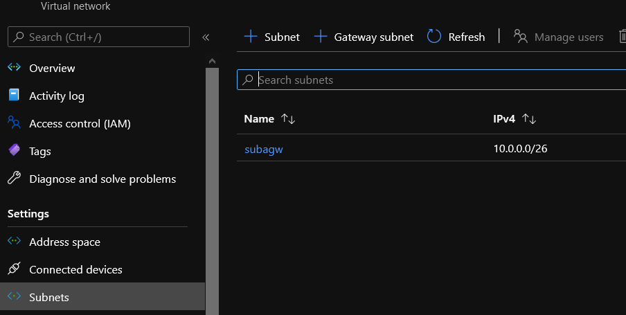

# Azure Virtual Network Module

## Module description

This module deploys an Azure Virtual Network

### Module inputs

| Variable name | Variable type | Default value | Description |
|:--------------|:--------------|:--------------|:------------|
| SubnetSuffix | string | N/A | A suffix forthe subnet. Changing this forces a new resource to be created. |
| RGName | string | N/A | The name of the resource group in which to create the subnet. Changing this forces a new resource to be created. |
| VNetName | string | N/A | The name of the virtual network to which to attach the subnet. Changing this forces a new resource to be created. | 
| Subnetaddressprefixes | list | N/A |  The address prefixes to use for the subnet. |  
| ServicesEP | list | N/A | The list of Service endpoints to associate with the subnet.<br>Possible values include:<br> Microsoft.AzureActiveDirectory, <br>Microsoft.AzureCosmosDB, <br>Microsoft.ContainerRegistry, <br>Microsoft.EventHub, <br>Microsoft.KeyVault, <br>Microsoft.ServiceBus, <br>Microsoft.Sql, <br>Microsoft.Storage <br>and Microsoft.Web. |
| SubnetDelegationName | string | N/A |  A name for the subnet delegation. |
| DelegationServiceName | string | N/A |  The name of service to delegate to. Possible values include <br>Microsoft.ApiManagement/service, <br>Microsoft.AzureCosmosDB/clusters, <br>Microsoft.BareMetal/AzureVMware, <br>Microsoft.BareMetal/CrayServers, <br>Microsoft.Batch/batchAccounts, <br>Microsoft.ContainerInstance/containerGroups, <br>Microsoft.Databricks/workspaces, <br>Microsoft.DBforMySQL/flexibleServers, <br>Microsoft.DBforMySQL/serversv2, Microsoft.DBforPostgreSQL/flexibleServers, <br>Microsoft.DBforPostgreSQL/serversv2, <br>Microsoft.DBforPostgreSQL/singleServers, <br>Microsoft.HardwareSecurityModules/dedicatedHSMs, <br>Microsoft.Kusto/clusters, <br>Microsoft.Logic/integrationServiceEnvironments, <br>Microsoft.MachineLearningServices/workspaces, <br>Microsoft.Netapp/volumes, <br>Microsoft.Network/managedResolvers, <br>Microsoft.PowerPlatform/vnetaccesslinks, <br>Microsoft.ServiceFabricMesh/networks, <br>Microsoft.Sql/managedInstances, <br>Microsoft.Sql/servers, <br>Microsoft.StreamAnalytics/streamingJobs, <br>Microsoft.Synapse/workspaces, <br>Microsoft.Web/hostingEnvironments, <br>and Microsoft.Web/serverFarms. |
| DelegationServiceActionList | list | N/A | A list of Actions which should be delegated. <br>This list is specific to the service to delegate to. <br>Possible values include <br>Microsoft.Network/networkinterfaces/*, <br>Microsoft.Network/virtualNetworks/subnets/action, <br>Microsoft.Network/virtualNetworks/subnets/join/action, <br>Microsoft.Network/virtualNetworks/subnets/prepareNetworkPolicies/action <br>and Microsoft.Network/virtualNetworks/subnets/unprepareNetworkPolicies/action. |


### Module outputs

| Output name | value | Description |
|:------------|:------|:------------|
| Name | `azurerm_subnet.Subnet.name`| The resource name |
| Id | `azurerm_subnet.Subnet.id` | The resource id|
| AddressPrefix | `azurerm_subnet.Subnet.address_prefix[0]` | The virtualnetwork address space|
| FullSubnet |`azurerm_subnet.Subnet` | Send all the information of the resource in the output|
  

## How to call the module

An existing RG is required, so use of data source is recommanded.
Use as follow:

```bash

module "subnet" {

    #Module location
    source = "github.com/dfrappart/Terra-AZModuletest//Modules_building_blocks//203_Subnet/"

    #Module variable
    SubnetSuffix                      = "aci"
    RGName                            = module.ResourceGroup.RGFull.name
    VNetName                          = module.VNet.VnetFull.name
    Subnetaddressprefixes             = [cidrsubnet(module.VNet.VnetFull.address_space[0],6,1)]
    SubnetDelegationName              = 
    DelegationServiceName             = "Microsoft.ContainerInstance/containerGroups"
    DelegationServiceActionList       = ["Microsoft.Network/virtualNetworks/subnets/join/action", "Microsoft.Network/virtualNetworks/subnets/prepareNetworkPolicies/action"]


}

```  


## Sample display

terraform plan should gives the following output:

```powershell

An execution plan has been generated and is shown below.
Resource actions are indicated with the following symbols:
  + create

Terraform will perform the following actions:

  # module.subnet.azurerm_subnet.Subnet will be created
  + resource "azurerm_subnet" "Subnet" {
      + address_prefix                                 = (known after apply)
      + address_prefixes                               = [
          + "10.0.0.0/26",
        ]
      + enforce_private_link_endpoint_network_policies = false
      + enforce_private_link_service_network_policies  = false
      + id                                             = (known after apply)
      + name                                           = "subagw"
      + resource_group_name                            = "rsgvaultlab"
      + virtual_network_name                           = "vnetaci"
    }

Plan: 1 to add, 0 to change, 0 to destroy.

```


## Sample deployment

After deployment, something simlilar is visible in the portal:

