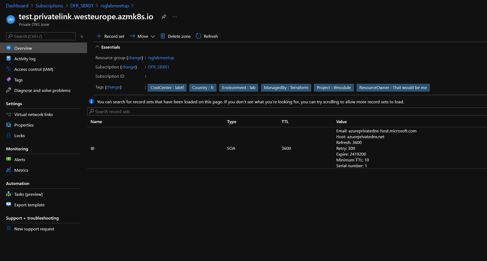

# NSG Module

## Module description

This module deploys a Private DNS Zone

### Module inputs

| Variable name | Variable type | Default value | Description |
|:--------------|:--------------|:--------------|:------------|
| PrivateDNSDomainName | string | N/A | The name of the Private DNS Zone. Must be a valid domain name. |
| RGName | string | N/A | The region in which the resource lives. Changing this forces a new resource to be created. |
| SOARecordEmail | string | N/A | The email contact for the SOA record. |
| SOARecordExpireTime | string | null | The expire time for the SOA record. Defaults to 2419200. |
| SOARecordMinTTL | string | null | The minimum Time To Live for the SOA record. By convention, it is used to determine the negative caching duration. Defaults to 10. |
| SOARecordRefreshTime | string | null | The refresh time for the SOA record. Defaults to 3600. |
| SOARecordRetryTime | string | null | The retry time for the SOA record. Defaults to 300. |
| SOARecordTTL | string | null | The Time To Live of the SOA Record in seconds. Defaults to 3600. |
| ResourceOwnerTag | string | That would be me | Tag describing the owner |
| CountryTag | string | fr | Tag describing the Country |
| CostCenterTag | string | tflab | Tag describing the Cost Center |
| Project | string | tfmodule | The name of the project |
| Environment | string | dev | The environment, dev, prod... |
| ExtraTags | map | {} | Additional optional tags. |


### Module outputs

| Output name | value | Description |
|:------------|:------|:------------|
| PrivateDNSZoneFull | `azurerm_private_dns_zone.PrivateDNSZone` | send all the resource information available in the output. |


## How to call the module

Use as follow:

```bash

module "PrivDNS" {

    #Module location
    source = "github.com/dfrappart/Terra-AZModuletest//Modules_building_blocks//241_PrivateDNSZone/"

    #Module variable
    PrivateDNSDomainName                  = "test.domain.ninja"
    RGName                                ="rsgdnsprivate"
    SOARecordEmail                        = "kakashi@konoha.ninja"
    


}

```

### Sample display

terraform plan should gives the following output:

```powershell

PS C:\Users\jubei.yagyu\01_Infra> terraform plan -target module.PrivDNS
module.ResourceGroup.azurerm_resource_group.RG: Refreshing state... [id=/subscriptions/00000000-0000-0000-0000-000000000000/resourceGroups/rsglabmeetup]

Terraform used the selected providers to generate the following execution plan. Resource actions are indicated with the following symbols:
  + create

Terraform will perform the following actions:

  # module.PrivDNS.azurerm_private_dns_zone.PrivateDNSZone will be created
  + resource "azurerm_private_dns_zone" "PrivateDNSZone" {
      + id                                                    = (known after apply)
      + max_number_of_record_sets                             = (known after apply)
      + max_number_of_virtual_network_links                   = (known after apply)
      + max_number_of_virtual_network_links_with_registration = (known after apply)
      + name                                                  = "test.privatelink.westeurope.azmk8s.io"
      + number_of_record_sets                                 = (known after apply)
      + resource_group_name                                   = "rsglabmeetup"
      + tags                                                  = {
          + "CostCenter"    = "labtf"
          + "Country"       = "fr"
          + "Environment"   = "lab"
          + "ManagedBy"     = "Terraform"
          + "Project"       = "tfmodule"
          + "ResourceOwner" = "That would be me"
        }

      + soa_record {
          + email         = (known after apply)
          + expire_time   = (known after apply)
          + fqdn          = (known after apply)
          + host_name     = (known after apply)
          + minimum_ttl   = (known after apply)
          + refresh_time  = (known after apply)
          + retry_time    = (known after apply)
          + serial_number = (known after apply)
          + tags          = (known after apply)
          + ttl           = (known after apply)
        }
    }

Plan: 1 to add, 0 to change, 0 to destroy.

```

## Sample deployment

After deployment, something simlilar is visible in the portal:

