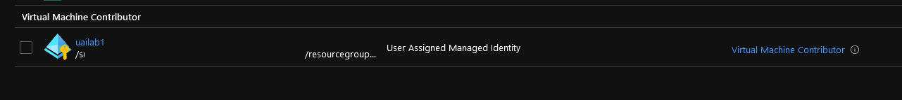

# Azure RBAC Builtin role assignment 

## Module description

This module assign a built in role to a principal.

### Module inputs

| Variable name | Variable type | Default value | Description |
|:--------------|:--------------|:--------------|:------------|
| RBACScope | string | N/A | The scope at which the Role Assignment applies to, such as /subscriptions/0b1f6471-1bf0-4dda-aec3-111122223333, /subscriptions/0b1f6471-1bf0-4dda-aec3-111122223333/resourceGroups/myGroup, or /subscriptions/0b1f6471-1bf0-4dda-aec3-111122223333/resourceGroups/myGroup/providers/Microsoft.Compute/virtualMachines/myVM, or /providers/Microsoft.Management/managementGroups/myMG. Changing this forces a new resource to be created. |
| BuiltinRoleName | string | N/A | The name of a built-in Role. Changing this forces a new resource to be created. Conflicts with role_definition_id. Refer to https://docs.microsoft.com/en-us/azure/role-based-access-control/built-in-roles for list of built in roles |
| ObjectId | string | N/A | The ID of the Principal (User, Group or Service Principal) to assign the Role Definition to. Changing this forces a new resource to be created. |


### Module outputs

| Output name | value | Description |
|:------------|:------|:------------|
| RBACAssignmentFull | `azurerm_role_assignment.TerraAssignedBuiltin` | send all the resource information available in the output. In future version, this may be the only output and detailed informtion will probably be queried specifically from the root module |
| RBACAssignmentGuid | `azurerm_role_assignment.TerraAssignedBuiltin.name` | The resource name |
| RBACAssignmentScope | `azurerm_role_assignment.TerraAssignedBuiltin.scope` | The scope of the assignment |
| RBACAssignmentRoleName | `azurerm_role_assignment.TerraAssignedBuiltin.role_definition_name` | The name of the RBAC Role |
| RBACAssignmentPrincipalId | `azurerm_role_assignment.TerraAssignedBuiltin.principal_id` | The principal Id of the principal assigned to the role |
| RBACAssignmentId | `azurerm_role_assignment.TerraAssignedBuiltin.id` | The resource Id |
| RBACAssignmentPrincipalType | `azurerm_role_assignment.TerraAssignedBuiltin.principal_type` | The type of principal assigned to the role |
  
  

## How to call the module
 

Use as follow:

```bash

# Creating the ResourceGroup

module "ResourceGroupVMAdmin" {

  #Module Location
  source                                = "../../Modules/002_ResourceGroup/"
  #Module variable    
  RGSuffix                              = "cpt_data"
  RGLocation                            = var.RGLocation
  ResourceOwnerTag                      = var.ResourceOwnerTag
  CountryTag                            = var.CountryTag
  CostCenterTag                         = var.CostCenterTag
  Company                               = var.Company
  Project                               = var.Project
  Environment                           = var.Environment


}

# Creating anUAI to be assigned to the role

module "UAI1" {

  #Module Location
  source                                  = "../../Modules_building_blocks/441_UserAssignedIdentity/"

  #Module variable
  UAISuffix                               = "lab1"
  TargetLocation                          = module.ResourceGroup.RGLocation
  TargetRG                                = module.ResourceGroup.RGName
  ResourceOwnerTag                        = "david@teknews.cloud"
  CountryTag                              = "fr"
  CostCenterTag                           = "labtf"
  Company                                 = "dfitc"
  Project                                 = "aks"
  Environment                             = "dev"


}

# Creating an Assignment

module "AssignUAI_Test" {

  #Module Location
  source                                  = "../../Modules_building_blocks/401_RBACAssignment_BuiltinRole/"

  #Module variable
  RBACScope                               = module.ResourceGroup.RGId
  BuiltinRoleName                         = "Virtual Machine Contributor"
  ObjectId                                = module.UAI1.FullUAIOutput.principal_id


}

```

## Sample display

terraform plan should gives the following output:

```powershell

PS C:\Users\user1\Documents\IaC\Azure\Terra-AZModuletest\Tests\RG> terraform plan
module.ResourceGroup.azurerm_resource_group.TerraRG: Refreshing state... [id=/subscriptions/xxxxxxxx-xxxx-xxxx-xxxx-xxxxxxxxxxxx/resourceGroups/rsg-lab-1]
module.UAI1.azurerm_user_assigned_identity.terraUAI: Refreshing state... [id=/subscriptions/xxxxxxxx-xxxx-xxxx-xxxx-xxxxxxxxxxxx/resourceGroups/rsg-lab-1/providers/Microsoft.ManagedIdentity/userAssignedIdentities/uailab1]

An execution plan has been generated and is shown below.
Resource actions are indicated with the following symbols:
  + create

Terraform will perform the following actions:

  # module.AssignUAI_Test.azurerm_role_assignment.TerraAssignedBuiltin will be created
  + resource "azurerm_role_assignment" "TerraAssignedBuiltin" {
      + id                               = (known after apply)
      + name                             = (known after apply)
      + principal_id                     = (sensitive)
      + principal_type                   = (known after apply)
      + role_definition_id               = (known after apply)
      + role_definition_name             = "Virtual Machine Contributor"
      + scope                            = "/subscriptions/xxxxxxxx-xxxx-xxxx-xxxx-xxxxxxxxxxxx/resourceGroups/rsg-lab-1"
      + skip_service_principal_aad_check = (known after apply)
    }

Plan: 1 to add, 0 to change, 0 to destroy.

Changes to Outputs:
  + Test_RBACAssignmentFull          = (sensitive value)
  + Test_RBACAssignmentGuid          = (known after apply)
  + Test_RBACAssignmentId            = (known after apply)
  + Test_RBACAssignmentPrincipalId   = (sensitive value)
  + Test_RBACAssignmentPrincipalType = (known after apply)
  + Test_RBACAssignmentRoleName      = "Virtual Machine Contributor"
  + Test_RBACAssignmentScope         = "/subscriptions/xxxxxxxx-xxxx-xxxx-xxxx-xxxxxxxxxxxx/resourceGroups/rsg-lab-1"

------------------------------------------------------------------------

Note: You didn't specify an "-out" parameter to save this plan, so Terraform
can't guarantee that exactly these actions will be performed if
"terraform apply" is subsequently run.


```

Output should be similar to this:

```powershell

Apply complete! Resources: 1 added, 0 changed, 0 destroyed.

Outputs:

RGId = <sensitive>
RGLocation = "westeurope"
RGName = "rsg-lab-1"
Test_RBACAssignmentFull = <sensitive>
Test_RBACAssignmentGuid = "807e3816-6e73-f254-64c0-39f403e9e53e"
Test_RBACAssignmentId = "/subscriptions/xxxxxxxx-xxxx-xxxx-xxxx-xxxxxxxxxxxx/resourceGroups/rsg-lab-1/providers/Microsoft.Authorization/roleAssignments/807e3816-6e73-f254-64c0-39f403e9e53e"
Test_RBACAssignmentPrincipalId = <sensitive>
Test_RBACAssignmentPrincipalType = "ServicePrincipal"
Test_RBACAssignmentRoleName = "Virtual Machine Contributor"
UAI1_FullOutput = <sensitive>
UAI1_Id = <sensitive>
UAI1_Location = "westeurope"
UAI1_Name = "uailab1"
UAI1_PrincipalId = <sensitive>
UAI1_RG = "rsg-lab-1"

```

## Sample deployment

After deployment, something simlilar is visible in the portal:




