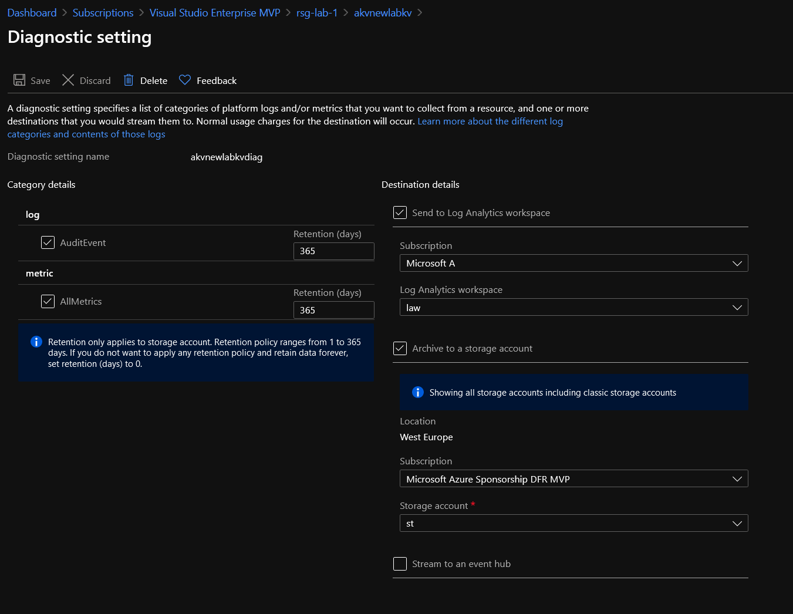

# Azure Keyvault 

## Module description

This module deploys an Azure KeyVault.
It includes configuration for:

- The KeyVault resource
- The Associate diagnostic settings

Future versions will include:

- Azure Monitor Alerts
- Virtual Network rules
- Network ACL block

Azure Monitor alerts rely on a existing Azure Action Group.

Diagnostic settings logs are sent to a storage account and a log analytic workspace.

### Module inputs

| Variable name | Variable type | Default value | Description |
|:--------------|:--------------|:--------------|:------------|
| KeyVaultSuffix | string | "1" | A suffix added to the keyvault name |
| TargetLocation | string | west europe | The Azure region for the resource |
| TargetRG | string | N/A | The resource group in which the resources will be deployed |
| KeyVaultSKUName |string | N/A | The SKU for the Key Vault |
| KeyVaultTenantID | string | N/A | The Azure Tenant Id |
| IsKVEnabledForRBAC | string | false | (Optional) Boolean flag to specify whether Azure Key Vault uses Role Based Access Control (RBAC) for authorization of data actions. Defaults to false. |
| IsKVPurgeProtectEnabled | string | false | (Optional) Is Purge Protection enabled for this Key Vault? Defaults to false. |
| KVSoftDeleteRetention | string | null | (Optional) The number of days that items should be retained for once soft-deleted. This value can be between 7 and 90 (the default) days. |
| KeyVaultEnabledforDeployment | string | null | Is the keyvault enabled for deployment |
| KeyVaultEnabledforTempDeploy | string | null | Is the keyvault enabled for Template deployment |
| KeyVaultEnabledforDiskEncrypt | string | null | Is the keyvault enabled for disk encryption |
| STASubLogId | string | null | The Id of the storage account for the logs |
| LawSubLogId | string | null | The Id of the log analytics workspace for the logs |
| ResourceOwnerTag | string | That would be me | Tag describing the owner |
| CountryTag | string | fr | Tag describing the Country |
| CostCenterTag | string | rxldefaultcostcenter | Tag describing the Cost Center which is the same as the one on the EA |
| Company | string | dfitc | The Company owner of the resources |
| Project | string | tfmodule | The name of the project |
| Environment | string | dev | The environment, dev, prod... |  
  


### Module outputs

| Output name | value | Description |
|:------------|:------|:------------|
| FullKVOutput | azurerm_key_vault.TerraKeyVault |send all the resource infromation available in the output. In future version, this may be the only output and detailed informtion will probably be queried specifically from the root module |
| Id | azurerm_key_vault.TerraKeyVault.id | The resource id of the keyvault |
| Name | azurerm_key_vault.TerraKeyVault.name | The name of the keyvault |
| Location | azurerm_key_vault.TerraKeyVault.location | The region in which the resource are deployed |
| RG | azurerm_key_vault.TerraKeyVault.resource_group_name | The region in which the resource are deployed |
| SKU | azurerm_key_vault.TerraKeyVault.sku_name | The sku of the keyvault |
| TenantId | azurerm_key_vault.TerraKeyVault.tenant_id | The tenant id of the keyvault |
| URI | azurerm_key_vault.TerraKeyVault.vault_uri | The uri of the keyvault |
| KeyVault_enabled_for_disk_encryption | azurerm_key_vault.TerraKeyVault.KeyVault_enabled_for_disk_encryption | Is the keyvault enabled for disk encryption? |
| KeyVault_enabled_for_template_deployment | azurerm_key_vault.TerraKeyVault.enabled_for_template_deployment | Is the kv enabled for template deployment? |  
  
  

## How to call the module
 

Use as follow:

```bash

# Creating the ResourceGroup

module "ResourceGroupVMAdmin" {

  #Module Location
  source                                = "../../Modules/002_ResourceGroup/"
  #Module variable    
  RGSuffix                              = "cpt_data"
  RGLocation                            = var.RGLocation
  ResourceOwnerTag                      = var.ResourceOwnerTag
  CountryTag                            = var.CountryTag
  CostCenterTag                         = var.CostCenterTag
  Company                               = var.Company
  Project                               = var.Project
  Environment                           = var.Environment


}

module "AKSKeyVault" {

  #Module Location
  source                                  = "../../Modules/410_Keyvault/"

  #Module variable     
  TargetRG                                = module.ResourceGroupVMAdmin.RGName
  TargetLocation                          = module.ResourceGroupVMAdmin.RGLocation
  KeyVaultTenantID                        = data.azurerm_subscription.current.tenant_id
  STASubLogId                             = data.azurerm_storage_account.STALogName.id
  LawSubLogId                             = data.azurerm_log_analytics_workspace.LAWLogName.id
  ResourceOwnerTag                        = var.ResourceOwnerTag
  CountryTag                              = var.CountryTag
  CostCenterTag                           = var.CostCenterTag
  Company                                 = var.Company
  Project                                 = var.Project
  Environment                             = var.Environment


}

```

## Sample display

terraform plan should gives the following output:

```powershell

PS C:\Users\user1\Documents\IaC\Azure\Terra-AZModuletest\Tests\RG> terraform plan

An execution plan has been generated and is shown below.
Resource actions are indicated with the following symbols:
  + create

Terraform will perform the following actions:

  # module.AKSKeyVault.azurerm_key_vault.TerraKeyVault will be created
  + resource "azurerm_key_vault" "TerraKeyVault" {
      + access_policy              = (known after apply)    
      + id                         = (known after apply)    
      + location                   = "westeurope"
      + name                       = "akv-dfitc-fr-lab-iac1"
      + resource_group_name        = "rsg-lab-1"
      + sku_name                   = "standard"
      + soft_delete_enabled        = (known after apply)
      + soft_delete_retention_days = 90
      + tags                       = {
          + "CostCenter"      = "iac"
          + "Country"         = "fr"
          + "Entity"          = "CloudTeam"
          + "Environment"     = "lab"
          + "ManagedBy"       = "Terraform"
          + "ResourceOwner"   = "david@teknews.cloud"
        }
      + tenant_id                  = "xxxxxxxx-xxxx-xxxx-xxxx-xxxxxxxxxxxx"
      + vault_uri                  = (known after apply)

      + network_acls {
          + bypass                     = (known after apply)
          + default_action             = (known after apply)
          + ip_rules                   = (known after apply)
          + virtual_network_subnet_ids = (known after apply)
        }
    }

  # module.AKSKeyVault.azurerm_monitor_diagnostic_setting.KVDiag will be created
  + resource "azurerm_monitor_diagnostic_setting" "KVDiag" {
      + id                         = (known after apply)
      + log_analytics_workspace_id = "/subscriptions/xxxxxxxx-xxxx-xxxx-xxxx-xxxxxxxxxxxx/resourcegroups/rsg-dffr-lab-subsetup-log/providers/microsoft.operationalinsights/workspaces/law-dffr-lab-subsetup-log16e85b36"        
      + name                       = "akv-dfitc-fr-lab-iac1diag"
      + storage_account_id         = "/subscriptions/xxxxxxxx-xxxx-xxxx-xxxx-xxxxxxxxxxxx/resourceGroups/rsg-dffr-lab-subsetup-log/providers/Microsoft.Storage/storageAccounts/stdffrlab16e85b36log"
      + target_resource_id         = (known after apply)

      + log {
          + category = "AuditEvent"
          + enabled  = true

          + retention_policy {
              + days    = 365
              + enabled = true
            }
        }

      + metric {
          + category = "AllMetrics"
          + enabled  = true

          + retention_policy {
              + days    = 365
              + enabled = true
            }
        }
    }

  # module.ResourceGroup.azurerm_resource_group.TerraRG will be created
  + resource "azurerm_resource_group" "TerraRG" {
      + id       = (known after apply)
      + location = "westeurope"
      + name     = "rsg-lab-1"
      + tags     = {
          + "CostCenter"    = "labtf"
          + "Country"       = "fr"
          + "Environment"   = "dev"
          + "ManagedBy"     = "Terraform"
          + "ResourceOwner" = "DFR"
        }
    }

Plan: 3 to add, 0 to change, 0 to destroy.

Changes to Outputs:
  + FullKVOutput = (sensitive value)
  + KVId         = (sensitive value)
  + KVLocation   = (sensitive value)
  + KVName       = (sensitive value)
  + KVRG         = (sensitive value)
  + KVSKU        = (sensitive value)
  + KVTenantId   = (sensitive value)
  + KVURI        = (sensitive value)
  + RGId         = (sensitive value)
  + RGLocation   = "westeurope"
  + RGName       = "rsg-lab-1"

------------------------------------------------------------------------

Note: You didn't specify an "-out" parameter to save this plan, so Terraform
can't guarantee that exactly these actions will be performed if
"terraform apply" is subsequently run.


```

Output should be similar to this:

```powershell

Apply complete! Resources: 3 added, 0 changed, 0 destroyed.

Outputs:

FullKVOutput = <sensitive>
KVId = <sensitive>
KVLocation = <sensitive>
KVName = <sensitive>
KVRG = <sensitive>
KVSKU = <sensitive>
KVTenantId = <sensitive>
KVURI = <sensitive>
RGId = <sensitive>
RGLocation = "westeurope"
RGName = "rsg-lab-1"

```

## Sample deployment

After deployment, something simlilar is visible in the portal:




