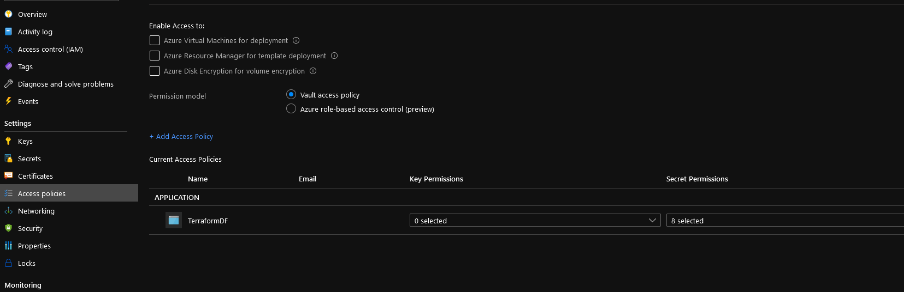

# Azure Keyvault 

## Module description

This module deploys an Azure KeyVault policy.


### Module inputs

| Variable name | Variable type | Default value | Description |
|:--------------|:--------------|:--------------|:------------|
| VaultId | string | N/A | (Required) Specifies the id of the Key Vault resource. Changing this forces a new resource to be created. |
| KeyVaultTenantId | string | N/A | (Required) The Azure Active Directory tenant ID that should be used for authenticating requests to the key vault. Changing this forces a new resource to be created. |
| KeyVaultAPObjectId | string | N/A | Required) The object ID of a user, service principal or security group in the Azure Active Directory tenant for the vault. The object ID must be unique for the list of access policies. Changing this forces a new resource to be created. |
| Keyperms |string | N/A | (Optional) List of key permissions, must be one or more from the following: backup, create, decrypt, delete, encrypt, get, import, list, purge, recover, restore, sign, unwrapKey, update, verify and wrapKey. |
| Secretperms | string | N/A | (Optional) List of secret permissions, must be one or more from the following: backup, delete, get, list, purge, recover, restore and set. |
| Certperms | string | N/A | Optional) List of certificate permissions, must be one or more from the following: backup, create, delete, deleteissuers, get, getissuers, import, list, listissuers, managecontacts, manageissuers, purge, recover, restore, setissuers and update. |
| Storageperms | string | N/A | (Optional) List of storage permissions, must be one or more from the following: backup, delete, deletesas, get, getsas, list, listsas, purge, recover, regeneratekey, restore, set, setsas and update. |

  


### Module outputs

| Output name | value | Description |
|:------------|:------|:------------|
| KeyVaultAcccessPolicyFullOutput | `azurerm_key_vault_access_policy.TerraKeyVaultAP` | send all the resource information available in the output. In future version, this may be the only output and detailed informtion will probably be queried specifically from the root module |
| KeyVaultId | `azurerm_key_vault_access_policy.TerraKeyVaultAP.key_vault_id` | The resource id of the keyvault |
| Id | `azurerm_key_vault_access_policy.TerraKeyVaultAP.id` | The id of the keyvault access policy |

  

## How to call the module
 

Use as follow:

```bash

module "AKSKeyVaultAccessPolicyTF" {

  #Module Location
  source                                  = "../../../Modules_building_blocks/411_KeyVault_Access_Policy/"

  #Module variable     
  VaultId                                 = module.AKSKeyVault.Id
  KeyVaultTenantId                        = data.azurerm_subscription.current.tenant_id
  KeyVaultAPObjectId                      = data.azurerm_client_config.currentclientconfig.object_id
  Secretperms                             = var.Secretperms_TFApp_AccessPolicy

  depends_on = [
    module.AKSKeyVault,
  ]

}

```

## Sample display

terraform plan should gives the following output:

```powershell

An execution plan has been generated and is shown below.
Resource actions are indicated with the following symbols:
  + create

Terraform will perform the following actions:

  # module.AKSKeyVaultAccessPolicyTF.azurerm_key_vault_access_policy.TerraKeyVaultAP will be created
  + resource "azurerm_key_vault_access_policy" "TerraKeyVaultAP" {
      + id                 = (known after apply)
      + key_vault_id       = "/subscriptions/xxxxxxxx-xxxx-xxxx-xxxx-xxxxxxxxxxxx/resourceGroups/rsglabmeetup/providers/Microsoft.KeyVault/vaults/akvfeb06"
      + object_id          = "xxxxxxxx-xxxx-xxxx-xxxx-xxxxxxxxxxxx"
      + secret_permissions = [
          + "backup",
          + "purge",
          + "recover",
          + "restore",
          + "get",
          + "list",
          + "set",
          + "delete",
        ]
      + tenant_id          = "xxxxxxxx-xxxx-xxxx-xxxx-xxxxxxxxxxxx"
    }

Plan: 1 to add, 0 to change, 0 to destroy.

Changes to Outputs:
Changes to Outputs:
  + AKSKeyVaultAccessPolicyTF_Id                              = (sensitive value)
  + AKSKeyVaultAccessPolicyTF_KeyVaultAcccessPolicyFullOutput = (sensitive value)
  + AKSKeyVaultAccessPolicyTF_KeyVaultId                      = (sensitive value)

------------------------------------------------------------------------

Note: You didn't specify an "-out" parameter to save this plan, so Terraform
can't guarantee that exactly these actions will be performed if
"terraform apply" is subsequently run.

```

Output should be similar to this:

```powershell

Apply complete! Resources: 1 added, 0 changed, 0 destroyed.

Outputs:

AKSKeyVaultAccessPolicyTF_Id = <sensitive>
AKSKeyVaultAccessPolicyTF_KeyVaultAcccessPolicyFullOutput = <sensitive>
AKSKeyVaultAccessPolicyTF_KeyVaultId = <sensitive>
========================Truncated=============================

```

## Sample deployment

After deployment, something simlilar is visible in the portal:




