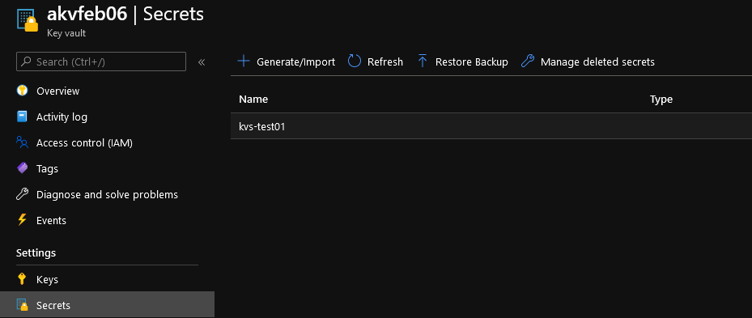
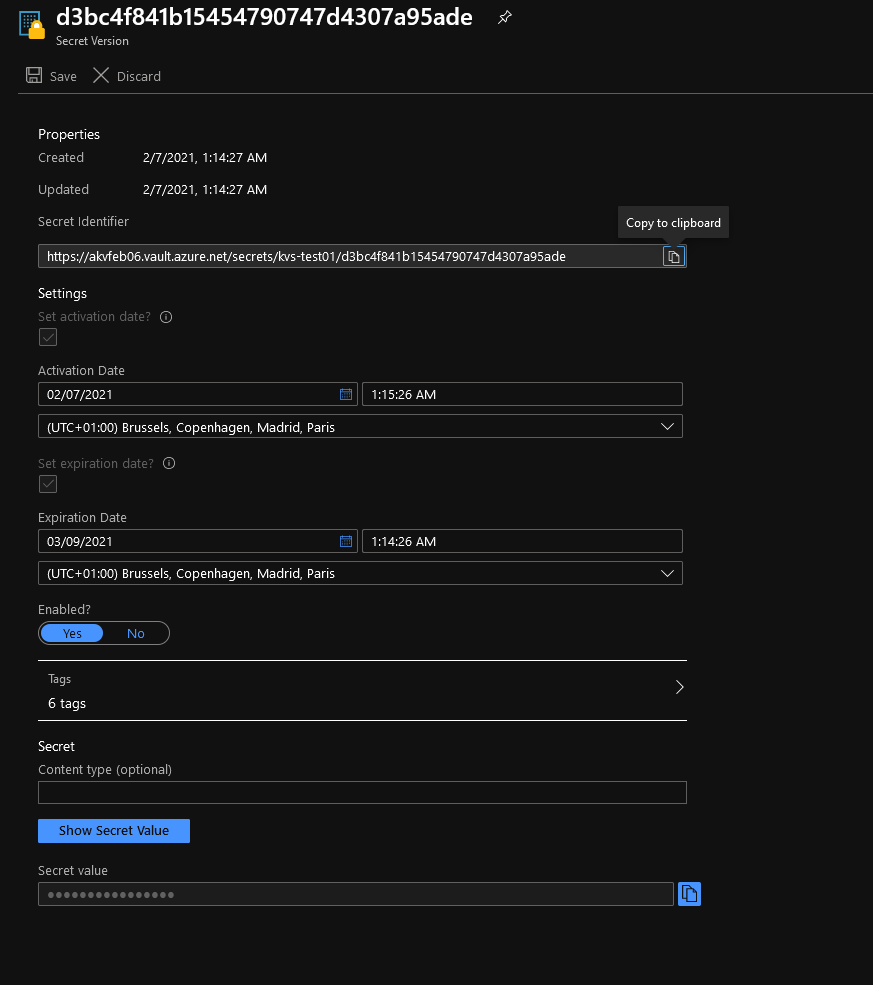

# Azure Keyvault secret

## Module description

This module deploys an Azure KeyVault secret.

### Module inputs

| Variable name | Variable type | Default value | Description |
|:--------------|:--------------|:--------------|:------------|
| KeyVaultSecretSuffix | string | N/A | A suffix added to the keyvault secret name |
| PasswordValue | string | "notspecified" | The value of the password to be stored in the keyvault |
| KeyVaultId | string | N/A | The ID of the Key Vault where the Secret should be created. |
| StartingDate |string | "notspecified" | An UTC datetime (Y-m-H:M:S'Z') defining when the secret is usable |
| ExpirationDate | string | "notspecified" | An UTC datetime (Y-m-H:M:S'Z') defining when the secret expires |
| SecretContentType | string | null | Specifies the content type for the Key Vault Secret |
| stringlenght | number | 16 | The default length of the secret |
| stringspecial | string | true | Is the password using special character? |
| stringupper | string | true | Is the password using capital character? |
| stringnumber | string | true | Is the password using number character? |
| ResourceOwnerTag | string | That would be me | Tag describing the owner |
| CountryTag | string | fr | Tag describing the Country |
| CostCenterTag | string | tflab | Tag describing the Cost Center |
| Company | string | dfitc | The Company owner of the resources |
| Project | string | tfmodule | The name of the project |
| Environment | string | lab | The environment, dev, prod... |  
| SecretUsedBy | string | "notspecified" | A tag defining who is using the password. Aim to be used for automation purpose |  
  


### Module outputs

| Output name | value | Description |
|:------------|:------|:------------|
| SecretFullOutput | `azurerm_key_vault_secret.TerraSecret` | send all the resource information available in the output. In future version, this may be the only output and detailed informtion will probably be queried specifically from the root module |
| Id | `azurerm_key_vault_secret.TerraSecret.id` | The resource id of the keyvault secret |
| Version | `azurerm_key_vault_secret.TerraSecret.version` | The version of the keyvault secret |
| Name | `azurerm_key_vault_secret.TerraSecret.name` | The name of the keyvault secret |

  
  

## How to call the module
 

Use as follow:

```bash

module "SecretTest_to_KV" {

  #Module Location
  source                                  = "github.com/dfrappart/Terra-AZModuletest//Modules_building_blocks//412_KeyvaultSecret/"

  #Module variable     
  KeyVaultSecretSuffix                    = "test1"
  #PasswordValue                           = module.SecretTest.Result
  KeyVaultId                              = module.AKSKeyVault.Id
  ResourceOwnerTag                        = var.ResourceOwnerTag
  CountryTag                              = var.CountryTag
  CostCenterTag                           = var.CostCenterTag
  Environment                             = var.Environment
  Project                                 = var.Project

  depends_on = [
    module.AKSKeyVault,
    module.AKSKeyVaultAccessPolicyTF
  ]

}

```

## Sample display

terraform plan should gives the following output:

```powershell

An execution plan has been generated and is shown below.
Resource actions are indicated with the following symbols:
  + create

Terraform will perform the following actions:

  # module.SecretTest_to_KV.azurerm_key_vault_secret.TerraSecret will be created
  + resource "azurerm_key_vault_secret" "TerraSecret" {
      + expiration_date = (known after apply)
      + id              = (known after apply)
      + key_vault_id    = "/subscriptions/xxxxxxxx-xxxx-xxxx-xxxx-xxxxxxxxxxxx/resourceGroups/rsglabmeetup/providers/Microsoft.KeyVault/vaults/akvfeb06"
      + name            = "kvs-test1"
      + not_before_date = (known after apply)
      + tags            = {
          + "CostCenter"    = "labaks"
          + "Country"       = "fr"
          + "ResourceOwner" = "That would be me"
          + "UsedBy"        = "notspecified"
          + "environment"   = "lab"
          + "managedBy"     = "Terraform"
        }
      + value           = (sensitive value)
      + version         = (known after apply)
    }

  # module.SecretTest_to_KV.random_password.TerraRandomPWD will be created
  + resource "random_password" "TerraRandomPWD" {
      + id          = (known after apply)
      + length      = 16
      + lower       = true
      + min_lower   = 0
      + min_numeric = 0
      + min_special = 0
      + min_upper   = 0
      + number      = true
      + result      = (sensitive value)
      + special     = true
      + upper       = true
    }

Plan: 2 to add, 0 to change, 0 to destroy.

Changes to Outputs:
  + SecretTest_FullOutput = (sensitive value)
  + SecretTest_Id         = (sensitive value)
  + SecretTest_Version    = (sensitive value)

------------------------------------------------------------------------

Note: You didn't specify an "-out" parameter to save this plan, so Terraform
can't guarantee that exactly these actions will be performed if
"terraform apply" is subsequently run.

```

Output should be similar to this:

```powershell

Apply complete! Resources: 2 added, 0 changed, 0 destroyed.

Outputs:

========================Truncated=============================
SecretTest_FullOutput = <sensitive>
SecretTest_Id = <sensitive>
SecretTest_Name = <sensitive>
SecretTest_Version = <sensitive>

```

## Sample deployment

After deployment, something simlilar is visible in the portal:





